# DB設計

## 共通監査列

| カラム物理名 | カラム論理名 | 型 | 既定値 | 非NULL | Unique | 備考 |
|---|---|---|---|---|---|---|
| create_datetime | 作成日 | timestamptz | CURRENT_TIMESTAMP | x |  |  |
| create_user | 作成ユーザー | varchar(32) | CURRENT_USER | x |  | 物理名を保存 |
| update_datetime | 更新日 | timestamptz | CURRENT_TIMESTAMP | x |  |  |
| update_user | 更新ユーザー | varchar(32) | CURRENT_USER | x |  | 物理名を保存 |
| soft_delete_flag | 論理削除フラグ | boolean | FALSE | x |  |  |

## テーブル一覧

| No | 物理名 | 論理名 | 分類 | 説明 |
|---|---|---|---|---|
| 1 | vtuber_profiles | Vtuberプロフィール | コンテンツ(動的) | プロフィール本体。特に言語に依存しないIDや数値、FKが設定してあるものなど |
| 2 | join_group | 所属 | コンテンツ(動的) | Vtuberの所属を管理する。ホロライブ、にじさんじ、個人勢など |
| 3 | tag | タグ | コンテンツ(動的) | ユーザーが任意でつけられるタグ。歌ってみた、ゲーム実況、ASMRなど |
| 4 | badge | バッジ | システム管理(静的) | システム的に自動で付与されるバッジを管理する。よく見られているVtuber、新人Vtuber、最近更新されたVtuberなど |
| 5 | activity_status | 活動状態 | システム管理(静的) | Vtuber、所属の活動状態を管理する。準備中、活動中、休止中、卒業済みなど |
| 6 | sns_link | SNSリンク | コンテンツ(動的) | プロフィールのSNSリンクを管理する。アイコン、ラベル、URLがあるため別テーブルになった |
| 7 | bbs_res | BBS | コンテンツ(動的) | 各Vtuber詳細画面でのチャットのレスを管理。 |
| 8 | page_author | ページ編集者 | コンテンツ(動的) | プロフィールの編集者を管理。編集内容も持つ。 |
| 9 | contact | 問い合わせ | コンテンツ(動的) | ユーザーからの問い合わせ情報。問い合わせ内容や連絡先を管理 |
| 10 | priority | 優先度 | システム管理(静的) | 管理者向け。問い合わせに対する優先度を管理するためのステータス定義。最優先、優先度低など |
| 11 | response_status | 対応状況 | システム管理(静的) | 管理者向け。問い合わせに対する対応状況を管理するためのステータス定義。未対応、対応中など |
| 12 | language | 表示言語 | システム管理(静的) | Webサイトが対応する言語の定義。 |
| 13 | screen_word | 画面文言 | システム管理(静的) | 画面表示する単語全般やプルダウン、バッジなどの中身を定義する。表示言語ごとに用意する。画面要素x表示言語 |
| 14 | sns_support | サポートするSNS | システム管理(静的) | Google,Tiktokなどについて、ログインに使用するサービスの有効無効、プロフィール画面のSNSリンク向けに、SNSのアイコンとサービス名、および有効無効、論理名、画像IDを管理 |
| 15 | profile_report | プロフィール通報 | コンテンツ(動的) | ユーザーからの通報情報。どういった通報であるかを管理 |
| 16 | report_reason | 通報理由 | システム管理(静的) | 通報の報告理由のプルダウン定義。 |
| 17 | users | ユーザー | コンテンツ(動的) | Vtuber本人や管理者も含めたユーザー情報 |
| 18 | theme | 画面テーマ | システム管理(静的) | サイト全体のテーマ設定。ライトテーマ、ダークテーマ、プロフィール帳テーマなど |
| 19 | user_role | ユーザー権限 | システム管理(静的) | ユーザーに紐づく権限。管理者、Vtuber、一般など |
| 20 | images_contents | 画像(ユーザー投稿) | コンテンツ(動的) | Vtuberのサムネイル画像など保管するCloud Storage(GCS)へのURLを管理する |
| 21 | images_system | 画像(システム管理) | システム管理(静的) | アイコン画像などのシステム固定の画像を保管するCloud Storage(GCS)へのURLを管理する |
| 22 | screen_element | 画面要素 | システム管理(静的) | 画面要素名の一覧を管理する |
| 23 | likes | いいね | コンテンツ(動的) | ユーザーからユーザーへのいいねを管理する |
| 24 | movie_link | 動画リンク | コンテンツ(動的) | プロフィールにリンクされる動画を管理する |
| 25 | relation | 関係値 | コンテンツ(動的) | 相関図に使用するプロフィール間の関係値（ノード）を管理する |
| 26 | vtuber_profiles_lang | Vtuberプロフィール(各言語) | コンテンツ(動的) | プロフィール本体。特に言語に依存する項目 |
| 27 | profile_tag | プロフィールのタグ | コンテンツ(動的) | プロフィールに紐づくタグを管理する |
| 28 | profile_activity | プロフィールの活動ジャンル | コンテンツ(動的) | プロフィールに紐づく活動ジャンルを管理する |

## テーブル定義詳細


### vtuber_profiles（Vtuberプロフィール）

| No | カラム物理名 | カラム論理名 | 型 | PK | FK | FK参照先 | 非NULL | Unique | デフォルト | 備考 |
|---:|---|---|---|---|---|---|---|---|---|---|
| 1 | vtuber_profiles_sequence_id | VtuberプロフィールID | serial | x |  |  | x(PK制約) | x(PK制約) | SEQUENCE |  |
| 2 | vtuber_profiles_id | VプロフィールID | varchar(8) |  |  |  | x | x |  | URLに使用する。可変 |
| 3 | user_id | ユーザーID | serial |  | x | users.users_sequence_id |  |  |  |  |
| 4 | join_group | 所属 | serial |  | x | join_group.join_group_sequence_id |  |  |  |  |
| 5 | debut_date | デビュー日 | timestamptz |  |  |  |  |  |  |  |
| 6 | activity_status | 活動状態 | serial |  | x | activity_status.activity_status_sequence_id | x |  |  |  |

### join_group（所属）

| No | カラム物理名 | カラム論理名 | 型 | PK | FK | FK参照先 | 非NULL | Unique | デフォルト | 備考 |
|---:|---|---|---|---|---|---|---|---|---|---|
| 1 | join_group_sequence_id | 所属ID | serial | x |  |  | x(PK制約) | x(PK制約) | SEQUENCE |  |
| 2 | group_name | 所属名 | varchar(64) |  |  |  | x | x |  |  |
| 3 | operation_status | 運営状態 | serial |  | x | activity_status.activity_status_sequence_id |  |  |  |  |
| 4 | group_detail | 所属説明 | text |  |  |  |  |  |  |  |

### tag（タグ）

| No | カラム物理名 | カラム論理名 | 型 | PK | FK | FK参照先 | 非NULL | Unique | デフォルト | 備考 |
|---:|---|---|---|---|---|---|---|---|---|---|
| 1 | tag_sequence_id | タグID | serial | x |  |  | x(PK制約) | x(PK制約) | SEQUENCE |  |
| 2 | tag | タグ名 | text |  |  |  | x | x |  |  |

### badge（バッジ）

| No | カラム物理名 | カラム論理名 | 型 | PK | FK | FK参照先 | 非NULL | Unique | デフォルト | 備考 |
|---:|---|---|---|---|---|---|---|---|---|---|
| 1 | badge_sequence_id | バッジID | serial | x |  |  | x(PK制約) | x(PK制約) | SEQUENCE |  |
| 2 | badge_physical_name | バッジ名(物理名) | varchar(24) |  |  |  | x | x |  | 論理名はscreen_wordテーブルで管理する。具体的な要素の候補：よく見られているVtuber、新人Vtuber、最近更新されたVTuber |

### activity_status（活動状態）

| No | カラム物理名 | カラム論理名 | 型 | PK | FK | FK参照先 | 非NULL | Unique | デフォルト | 備考 |
|---:|---|---|---|---|---|---|---|---|---|---|
| 1 | activity_status_sequence_id | 活動状態ID | serial | x |  |  | x(PK制約) | x(PK制約) | SEQUENCE |  |
| 2 | activity_status_physical_name | 活動状態名(物理名) | varchar(8) |  |  |  | x | x |  | 論理名はscreen_wordテーブルで管理する。具体的な要素の候補：活動開始前(VTuber準備中)、活動中、卒業済み |

### sns_link（SNSリンク）

| No | カラム物理名 | カラム論理名 | 型 | PK | FK | FK参照先 | 非NULL | Unique | デフォルト | 備考 |
|---:|---|---|---|---|---|---|---|---|---|---|
| 1 | sns_link_sequence_id | SNSリンクID | serial | x |  |  | x(PK制約) | x(PK制約) | SEQUENCE |  |
| 2 | vtuber_profiles_id | VプロフィールID | serial |  | x | vtuber_profiles.vtuber_profiles_sequence_id | x |  |  |  |
| 3 | sns_icon | SNSアイコン | serial |  | x | sns_support.sns_support_sequence_id |  |  |  | 選択なしも含む |
| 4 | sns_link_label | ラベル名 | varchar(32) |  |  |  |  |  | SNSアイコンに紐づくSNS名 |  |
| 5 | sns_url | URL | text |  |  |  | x |  |  |  |

### bbs_res（BBS）

| No | カラム物理名 | カラム論理名 | 型 | PK | FK | FK参照先 | 非NULL | Unique | デフォルト | 備考 |
|---:|---|---|---|---|---|---|---|---|---|---|
| 1 | bbs_res_sequence_id | BBSID | serial | x |  |  | x(PK制約) | x(PK制約) | SEQUENCE |  |
| 2 | vtuber_profiles_id | VプロフィールID | serial |  | x | vtuber_profiles.vtuber_profiles_sequence_id | x |  |  |  |
| 3 | user_id | ユーザーID | serial |  | x | users.users_sequence_id | x |  |  |  |
| 4 | res_text | レス内容 | text |  |  |  | x |  |  |  |
| 5 | res_datetime | 投稿日時時刻 | timestamptz |  |  |  | x |  |  |  |

### page_author（ページ編集者）

| No | カラム物理名 | カラム論理名 | 型 | PK | FK | FK参照先 | 非NULL | Unique | デフォルト | 備考 |
|---:|---|---|---|---|---|---|---|---|---|---|
| 1 | page_author_sequence_id | ページ編集者ID | serial | x |  |  | x(PK制約) | x(PK制約) | SEQUENCE |  |
| 2 | user_id | ユーザーID | serial |  | x | users.users_sequence_id | x |  |  |  |
| 3 | vtuber_profiles_id | ユーザーID | serial |  | x | vtuber_profiles.vtuber_profiles_sequence_id | x |  |  |  |
| 4 | fix_item | 修正項目 | serial |  | x | screen_word.screen_word_sequence_id | x |  |  |  |
| 5 | fix_before | 修正前 | text |  |  |  | x |  |  |  |
| 6 | fix_after | 修正後 | text |  |  |  | x |  |  |  |
| 7 | fix_datetime | 修正日時 | timestamptz |  |  |  | x |  | CURRENT_TIMESTAMP |  |
| 8 | report_count | 通報数 | integer |  |  |  | x |  | 0 |  |

### contact（問い合わせ）

| No | カラム物理名 | カラム論理名 | 型 | PK | FK | FK参照先 | 非NULL | Unique | デフォルト | 備考 |
|---:|---|---|---|---|---|---|---|---|---|---|
| 1 | contact_sequence_id | 問い合わせID | serial | x |  |  | x(PK制約) | x(PK制約) | SEQUENCE |  |
| 2 | mail_address | メールアドレス | varchar(255) |  |  |  | x |  |  |  |
| 3 | subject | 件名 | varchar(255) |  |  |  | x |  |  |  |
| 4 | contact_detail | 問い合わせ内容 | text |  |  |  | x |  |  |  |
| 5 | priority_physical_name | 優先度(物理名) | serial |  | x | priority.priority_sequence_id |  |  |  |  |
| 6 | response_status_physical_name | 対応状況(物理名) | serial |  | x | response_status.response_status_sequence_id |  |  |  |  |

### priority（優先度）

| No | カラム物理名 | カラム論理名 | 型 | PK | FK | FK参照先 | 非NULL | Unique | デフォルト | 備考 |
|---:|---|---|---|---|---|---|---|---|---|---|
| 1 | priority_sequence_id | 優先度ID | serial | x |  |  | x(PK制約) | x(PK制約) | SEQUENCE |  |
| 2 | priority_physical_name | 優先度(物理名) | varchar(8) |  |  |  | x | x |  |  |
| 3 | priority_logical_name | 優先度(論理名) | varchar(8) |  |  |  |  |  |  | 管理者向けのため、日本語固定 |

### response_status（対応状況）

| No | カラム物理名 | カラム論理名 | 型 | PK | FK | FK参照先 | 非NULL | Unique | デフォルト | 備考 |
|---:|---|---|---|---|---|---|---|---|---|---|
| 1 | response_status_sequence_id | 対応状況ID | serial | x |  |  | x(PK制約) | x(PK制約) | SEQUENCE |  |
| 2 | response_status_physical_name | 対応状況(物理名) | varchar(8) |  |  |  | x | x |  |  |
| 3 | response_status_logical_name | 対応状況(論理名) | varchar(8) |  |  |  |  |  |  | 管理者向けのため、日本語固定 |

### language（表示言語）

| No | カラム物理名 | カラム論理名 | 型 | PK | FK | FK参照先 | 非NULL | Unique | デフォルト | 備考 |
|---:|---|---|---|---|---|---|---|---|---|---|
| 1 | language_sequence_id | 表示言語ID | serial | x |  |  | x(PK制約) | x(PK制約) | SEQUENCE |  |
| 2 | language_physical_name | 表示言語(物理名) | varchar(16) |  |  |  | x | x |  | 論理名はscreen_wordテーブルで管理する |
| 4 | language_image | 言語画像 | bigserial |  |  |  |  |  |  | SVG |
| 5 | enable | 有効フラグ | boolean |  |  |  | x |  | FALSE |  |

### screen_word（画面文言）

| No | カラム物理名 | カラム論理名 | 型 | PK | FK | FK参照先 | 非NULL | Unique | デフォルト | 備考 |
|---:|---|---|---|---|---|---|---|---|---|---|
| 1 | screen_word_sequence_id | 画面文言ID | serial | x |  |  | x(PK制約) | x(PK制約) | SEQUENCE |  |
| 2 | language_physical_name | 表示言語(物理名) | serial |  | x | language.language_sequence_id |  |  |  |  |
| 3 | message_id | メッセージID | serial |  |  |  |  |  |  |  |
| 4 | display_message | 文言 | text |  |  |  |  |  |  |  |
| 5 | message_type | 文言種別 | enum |  |  |  |  |  |  | "screen_element","other_tables" |

### sns_support（サポートするSNS）

| No | カラム物理名 | カラム論理名 | 型 | PK | FK | FK参照先 | 非NULL | Unique | デフォルト | 備考 |
|---:|---|---|---|---|---|---|---|---|---|---|
| 1 | sns_support_sequence_id | サポートするSNSID | serial | x |  |  | x(PK制約) | x(PK制約) | SEQUENCE |  |
| 2 | sns_name_physical_name | サービス名(物理名) | varchar(32) |  |  |  | x | x |  |  |
| 4 | image_id | 画像ID | serial |  | x | images_system.images_system_sequence_id | x |  |  | SVG形式 |
| 5 | use_login_service | ログインサービス有効フラグ | boolean |  |  |  | x |  | TRUE |  |
| 6 | use_sns_link | SNSリンク有効フラグ | boolean |  |  |  | x |  | TRUE |  |

### profile_report（プロフィール通報）

| No | カラム物理名 | カラム論理名 | 型 | PK | FK | FK参照先 | 非NULL | Unique | デフォルト | 備考 |
|---:|---|---|---|---|---|---|---|---|---|---|
| 1 | profile_report_sequence_id | プロフィール通報ID | serial | x |  |  | x(PK制約) | x(PK制約) | SEQUENCE |  |
| 2 | user_id | ユーザーID | serial |  | x | users.users_sequence_id |  |  |  |  |
| 3 | vtuber_profiles_id | VプロフィールID | serial |  | x | vtuber_profiles.vtuber_profiles_sequence_id | x |  |  |  |
| 4 | report_reason_physical_name | 通報理由(物理名) | serial |  | x | report_reason.report_reason_sequence_id | x |  |  |  |
| 5 | report_detail | 詳細 | text |  |  |  | x |  |  |  |
| 6 | report_datetime | 通報日時 | timestamptz |  |  |  | x |  | CURRENT_TIMESTAMP |  |

### report_reason（通報理由）

| No | カラム物理名 | カラム論理名 | 型 | PK | FK | FK参照先 | 非NULL | Unique | デフォルト | 備考 |
|---:|---|---|---|---|---|---|---|---|---|---|
| 1 | report_reason_sequence_id | 通報理由ID | serial | x |  |  | x(PK制約) | x(PK制約) | SEQUENCE |  |
| 2 | report_reason_physical_name | 通報理由(物理名) | varchar(16) |  |  |  | x | x |  | 論理名はscreen_wordテーブルで管理する |

### users（ユーザー）

| No | カラム物理名 | カラム論理名 | 型 | PK | FK | FK参照先 | 非NULL | Unique | デフォルト | 備考 |
|---:|---|---|---|---|---|---|---|---|---|---|
| 1 | users_sequence_id | ユーザーID | serial | x |  |  | x(PK制約) | x(PK制約) | SEQUENCE |  |
| 2 | user_id | ユーザーID | varchar(8) |  |  |  | x | x | 自動払い出し |  |
| 3 | user_name | ユーザー名 | varchar(64) |  |  |  |  |  |  |  |
| 4 | user_role_physical_name | ユーザー権限(物理名) | serial |  | x | user_role.user_role_sequence_id |  |  |  |  |
| 5 | user_name_hidden_flag | 画面非表示フラグ | boolean |  |  |  | x |  | FALSE |  |
| 6 | login_service | ログインサービス | serial |  | x | sns_support.sns_support_sequence_id |  |  |  |  |
| 7 | register_date | 登録日 | timestamptz |  |  |  | x |  | CURRENT_TIMESTAMP |  |
| 8 | disp_theme | 画面テーマ | serial |  | x | theme.theme_sequence_id | x |  | "default"のID |  |
| 9 | language | 表示言語 | serial |  | x | language.language_sequence_id | x |  | "japan"のID |  |

### theme（画面テーマ）

| No | カラム物理名 | カラム論理名 | 型 | PK | FK | FK参照先 | 非NULL | Unique | デフォルト | 備考 |
|---:|---|---|---|---|---|---|---|---|---|---|
| 1 | theme_sequence_id | 画面テーマID | serial | x |  |  | x(PK制約) | x(PK制約) | SEQUENCE |  |
| 2 | theme_physical_name | 画面テーマ(物理名) | varchar(16) |  |  |  | x | x |  | 論理名はscreen_wordテーブルで管理する |

### user_role（ユーザー権限）

| No | カラム物理名 | カラム論理名 | 型 | PK | FK | FK参照先 | 非NULL | Unique | デフォルト | 備考 |
|---:|---|---|---|---|---|---|---|---|---|---|
| 1 | user_role_sequence_id | ユーザー権限ID | serial | x |  |  | x(PK制約) | x(PK制約) | SEQUENCE |  |
| 2 | user_role_physical_name | ユーザー権限(物理名) | varchar(8) |  |  |  | x | x |  | 論理名はscreen_wordテーブルで管理する |

### images_contents（画像(ユーザー投稿)）

| No | カラム物理名 | カラム論理名 | 型 | PK | FK | FK参照先 | 非NULL | Unique | デフォルト | 備考 |
|---:|---|---|---|---|---|---|---|---|---|---|
| 1 | images_contents_sequence_id | 画像(ユーザー投稿)ID | serial | x |  |  | x(PK制約) | x(PK制約) | SEQUENCE |  |
| 2 | image_id | 画像ID | bigserial |  |  |  | x | x |  |  |
| 3 | user_id | ユーザーID | serial |  | x | users.users_sequence_id | x |  |  |  |
| 4 | gcs_bucket | バケット名 | varchar(100) |  |  |  | x |  |  |  |
| 5 | gcs_object_name | オブジェクトパス | varchar(512) |  |  |  | x |  |  |  |
| 6 | cdn_url | CDNのURL | varchar(512) |  |  |  |  |  |  |  |
| 7 | content_type | コンテンツタイプ(拡張子等) | varchar(50) |  |  |  |  |  |  |  |
| 8 | width | 画像幅 | integer |  |  |  |  |  |  |  |
| 9 | height | 画像高 | integer |  |  |  |  |  |  |  |
| 10 | file_size | ファイルサイズ | integer |  |  |  |  |  |  |  |
| 11 | alt_text | 付加テキスト | varchar(255) |  |  |  |  |  |  |  |

### images_system（画像(システム管理)）

| No | カラム物理名 | カラム論理名 | 型 | PK | FK | FK参照先 | 非NULL | Unique | デフォルト | 備考 |
|---:|---|---|---|---|---|---|---|---|---|---|
| 1 | images_system_sequence_id | 画像(システム管理)ID | serial | x |  |  | x(PK制約) | x(PK制約) | SEQUENCE |  |
| 2 | image_id | 画像ID | bigserial |  |  |  | x | x |  |  |
| 3 | gcs_bucket | バケット名 | varchar(100) |  |  |  | x |  |  |  |
| 4 | gcs_object_name | オブジェクトパス | varchar(512) |  |  |  | x |  |  |  |
| 5 | cdn_url | CDNのURL | varchar(512) |  |  |  |  |  |  |  |
| 6 | content_type | コンテンツタイプ(拡張子等) | varchar(50) |  |  |  |  |  |  |  |
| 7 | width | 画像幅 | integer |  |  |  |  |  |  |  |
| 8 | height | 画像高 | integer |  |  |  |  |  |  |  |
| 9 | file_size | ファイルサイズ | integer |  |  |  |  |  |  |  |
| 10 | alt_text | 付加テキスト | varchar(255) |  |  |  |  |  |  |  |

### screen_element（画面要素）

| No | カラム物理名 | カラム論理名 | 型 | PK | FK | FK参照先 | 非NULL | Unique | デフォルト | 備考 |
|---:|---|---|---|---|---|---|---|---|---|---|
| 1 | screen_element_sequence_id | 画面要素ID | serial | x |  |  | x(PK制約) | x(PK制約) | SEQUENCE |  |
| 2 | message_id | メッセージID | varchar(16) |  |  |  | x | x |  |  |

### likes（いいね）

| No | カラム物理名 | カラム論理名 | 型 | PK | FK | FK参照先 | 非NULL | Unique | デフォルト | 備考 |
|---:|---|---|---|---|---|---|---|---|---|---|
| 1 | likes_sequence_id | いいねID | serial | x |  |  | x(PK制約) | x(PK制約) | SEQUENCE |  |
| 2 | likes_do_user | いいねした人 | serial |  | x | users.users_sequence_id | x | △ |  | likes_do_user + likes_target_user + likes_type で UNIQUEにする |
| 3 | likes_target_user | いいねされた人 | serial |  | x | users.users_sequence_id | x | △ |  | likes_do_user + likes_target_user + likes_type で UNIQUEにする |
| 4 | likes_type | いいね種別 | enum |  |  |  | x | △ |  | プロフィール、編集の2種。likes_do_user + likes_target_user + likes_type で UNIQUEにする |
| 5 | likes_datetime | いいねした日 | timestamptz |  |  |  | x |  |  |  |

### movie_link（動画リンク）

| No | カラム物理名 | カラム論理名 | 型 | PK | FK | FK参照先 | 非NULL | Unique | デフォルト | 備考 |
|---:|---|---|---|---|---|---|---|---|---|---|
| 1 | movie_link_sequence_id | 動画リンクID | serial | x |  |  | x(PK制約) | x(PK制約) | SEQUENCE |  |
| 2 | movie_id | 動画ID | bigserial |  |  |  | x | x |  |  |
| 3 | vtuber_profiles_id | VプロフィールID | serial |  | x | vtuber_profiles.vtuber_profiles_sequence_id | x |  |  |  |
| 4 | url | 動画URL | text |  |  |  | x |  |  |  |

### relation（関係値）

| No | カラム物理名 | カラム論理名 | 型 | PK | FK | FK参照先 | 非NULL | Unique | デフォルト | 備考 |
|---:|---|---|---|---|---|---|---|---|---|---|
| 1 | relation_sequence_id | 関係値ID | serial | x |  |  | x(PK制約) | x(PK制約) | SEQUENCE |  |
| 2 | node_from | ノード元 | serial |  | x | vtuber_profiles.vtuber_profiles_sequence_id | x | △ |  | node_from + node_to で UNIQUEにする |
| 3 | node_to | ノード先 | serial |  | x | vtuber_profiles.vtuber_profiles_sequence_id | x | △ |  | node_from + node_to で UNIQUEにする |
| 4 | node_name | 関係名 | varchar(32) |  |  |  | x |  |  |  |

### vtuber_profiles_lang（Vtuberプロフィール(各言語)）

| No | カラム物理名 | カラム論理名 | 型 | PK | FK | FK参照先 | 非NULL | Unique | デフォルト | 備考 |
|---:|---|---|---|---|---|---|---|---|---|---|
| 1 | vtuber_profiles_lang_sequence_id | Vtuberプロフィール(各言語)ID | serial | x |  |  | x(PK制約) | x(PK制約) | SEQUENCE |  |
| 2 | vtuber_profiles_id | VプロフィールID | serial |  | x | vtuber_profiles.vtuber_profiles_sequence_id | x | △ |  | vtuber_profiles_id + lang で UNIQUEにする |
| 3 | lang | 言語 | serial |  | x | language.language_sequence_id | x | △ |  | vtuber_profiles_id + lang で UNIQUEにする |
| 4 | name | 名前 | varchar(128) |  |  |  | x |  |  |  |
| 5 | nickname | ニックネーム | varchar(128) |  |  |  |  |  |  |  |
| 6 | birthday | 誕生日 | varchar(32) |  |  |  |  |  |  |  |
| 7 | blood_type | 血液型 | varchar(16) |  |  |  |  |  |  |  |
| 8 | height | 身長 | varchar(16) |  |  |  |  |  |  |  |
| 9 | mutter | ひとこと | text |  |  |  |  |  |  |  |
| 10 | catchphrase | キャッチフレーズ | varchar(64) |  |  |  |  |  |  |  |
| 11 | favorite | 好きなもの | varchar(64) |  |  |  |  |  |  |  |
| 12 | dis_favorite | 苦手なもの | varchar(64) |  |  |  |  |  |  |  |
| 13 | hobby | 趣味・特技 | varchar(64) |  |  |  |  |  |  |  |
| 14 | dream | 将来の夢 | varchar(64) |  |  |  |  |  |  |  |
| 15 | messages | メッセージ | text |  |  |  |  |  |  |  |
| 16 | profile_detail | プロフィール詳細 | text |  |  |  |  |  |  | マークダウン対応 |

### profile_tag（プロフィールのタグ）

| No | カラム物理名 | カラム論理名 | 型 | PK | FK | FK参照先 | 非NULL | Unique | デフォルト | 備考 |
|---:|---|---|---|---|---|---|---|---|---|---|
| 1 | profile_tag_sequence_id | プロフィールのタグID | serial | x |  |  | x(PK制約) | x(PK制約) | SEQUENCE |  |
| 2 | vtuber_profiles_id | VプロフィールID | serial |  | x | vtuber_profiles.vtuber_profiles_sequence_id | x | △ |  | vtuber_profiles_id + tag で UNIQUEにする |
| 3 | tag | タグ名 | serial |  | x | tag.tag_sequence_id | x | △ |  | vtuber_profiles_id + tag で UNIQUEにする |

### profile_activity（プロフィールの活動ジャンル）

| No | カラム物理名 | カラム論理名 | 型 | PK | FK | FK参照先 | 非NULL | Unique | デフォルト | 備考 |
|---:|---|---|---|---|---|---|---|---|---|---|
| 1 | profile_activity_sequence_id | プロフィールの活動ジャンルID | serial | x |  |  | x(PK制約) | x(PK制約) | SEQUENCE |  |
| 2 | vtuber_profiles_id | VプロフィールID | serial |  | x | vtuber_profiles.vtuber_profiles_sequence_id | x | △ |  | vtuber_profiles_id + activity で UNIQUEにする |
| 3 | activity | 活動ジャンル | varchar(16) |  |  |  | x | △ |  | vtuber_profiles_id + activity で UNIQUEにする |

## ER図

```mermaid
erDiagram
    vtuber_profiles {
        serial vtuber_profiles_sequence_id PK
        serial user_id FK
        serial join_group FK
        serial activity_status FK
    }
    join_group {
        serial join_group_sequence_id PK
        serial operation_status FK
    }
    tag {
        serial tag_sequence_id PK
    }
    badge {
        serial badge_sequence_id PK
    }
    activity_status {
        serial activity_status_sequence_id PK
    }
    sns_link {
        serial sns_link_sequence_id PK
        serial vtuber_profiles_id FK
        serial sns_icon FK
    }
    bbs_res {
        serial bbs_res_sequence_id PK
        serial vtuber_profiles_id FK
        serial user_id FK
    }
    page_author {
        serial page_author_sequence_id PK
        serial user_id FK
        serial vtuber_profiles_id FK
        serial fix_item FK
    }
    contact {
        serial contact_sequence_id PK
        serial priority_physical_name FK
        serial response_status_physical_name FK
    }
    priority {
        serial priority_sequence_id PK
    }
    response_status {
        serial response_status_sequence_id PK
    }
    language {
        serial language_sequence_id PK
    }
    screen_word {
        serial screen_word_sequence_id PK
        serial language_physical_name FK
        serial message_id FK
    }
    sns_support {
        serial sns_support_sequence_id PK
        serial image_id FK
    }
    profile_report {
        serial profile_report_sequence_id PK
        serial user_id FK
        serial vtuber_profiles_id FK
        serial report_reason_physical_name FK
    }
    report_reason {
        serial report_reason_sequence_id PK
    }
    users {
        serial users_sequence_id PK
        serial user_role_physical_name FK
        serial login_service FK
        serial disp_theme FK
        serial language FK
    }
    theme {
        serial theme_sequence_id PK
    }
    user_role {
        serial user_role_sequence_id PK
    }
    images_contents {
        serial images_contents_sequence_id PK
        serial user_id FK
    }
    images_system {
        serial images_system_sequence_id PK
    }
    screen_element {
        serial screen_element_sequence_id PK
    }
    likes {
        serial likes_sequence_id PK
        serial likes_do_user FK
        serial likes_target_user FK
    }
    movie_link {
        serial movie_link_sequence_id PK
        serial vtuber_profiles_id FK
    }
    relation {
        serial relation_sequence_id PK
        serial node_from FK
        serial node_to FK
    }
    vtuber_profiles_lang {
        serial vtuber_profiles_lang_sequence_id PK
        serial vtuber_profiles_id FK
        serial lang FK
    }
    profile_tag {
        serial profile_tag_sequence_id PK
        serial vtuber_profiles_id FK
        serial tag FK
    }
    profile_activity {
        serial profile_activity_sequence_id PK
        serial vtuber_profiles_id FK
    }

    vtuber_profiles ||--o{ sns_link : has
    vtuber_profiles ||--o{ bbs_res : has
    vtuber_profiles ||--o{ page_author : has
    vtuber_profiles ||--o{ profile_report : has
    vtuber_profiles ||--o{ movie_link : has
    vtuber_profiles ||--o{ relation : node_from
    vtuber_profiles ||--o{ relation : node_to
    vtuber_profiles ||--o{ vtuber_profiles_lang : has
    vtuber_profiles ||--o{ profile_tag : has
    vtuber_profiles ||--o{ profile_activity : has
    vtuber_profiles }o--|| users : owned_by
    vtuber_profiles }o--|| join_group : belongs_to
    vtuber_profiles }o--|| activity_status : status

    join_group }o--|| activity_status : operation_status

    sns_link }o--|| vtuber_profiles : profile
    sns_link }o--|| sns_support : icon

    bbs_res }o--|| vtuber_profiles : profile
    bbs_res }o--|| users : author

    page_author }o--|| users : author
    page_author }o--|| vtuber_profiles : profile
    page_author }o--|| screen_word : fix_item

    contact }o--|| priority : priority
    contact }o--|| response_status : response

    screen_word }o--|| language : language
    screen_word }o--|| screen_element : element

    sns_support }o--|| language : sns_name
    sns_support }o--|| images_system : image

    profile_report }o--|| users : reporter
    profile_report }o--|| vtuber_profiles : target
    profile_report }o--|| report_reason : reason

    users }o--|| user_role : role
    users }o--|| sns_support : login_service
    users }o--|| theme : theme
    users }o--|| language : language

    images_contents }o--|| users : owner

    likes }o--|| users : do_user
    likes }o--|| users : target_user

    movie_link }o--|| vtuber_profiles : profile

    relation }o--|| vtuber_profiles : source
    relation }o--|| vtuber_profiles : target

    vtuber_profiles_lang }o--|| vtuber_profiles : profile
    vtuber_profiles_lang }o--|| language : language

    profile_tag }o--|| vtuber_profiles : profile
    profile_tag }o--|| tag : tag

    profile_activity }o--|| vtuber_profiles : profile
```



---

## ENUM型定義

PostgreSQLの `CREATE TYPE` で定義するENUM型の一覧。

| 型名（物理名） | 論理名 | 値一覧 | 使用テーブル.カラム |
|---|---|---|---|
| `likes_type_enum` | いいね種別 | `profile`, `edit` | `likes.likes_type` |
| `message_type_enum` | 文言種別 | `screen_element`, `other_tables` | `screen_word.message_type` |

### DDL例

```sql
CREATE TYPE likes_type_enum AS ENUM ('profile', 'edit');
CREATE TYPE message_type_enum AS ENUM ('screen_element', 'other_tables');
```

---

## インデックス設計

### 基本方針
- PKはPostgreSQLが自動でインデックスを作成するため記載しない
- UNIQUE制約もPostgreSQLが自動でインデックスを作成するため別途不要
- FK列（外部キー）と絞り込み・ソートに使うカラムに作成する

### インデックス一覧

| No | テーブル物理名 | インデックス名 | 対象カラム | 種別 | 備考 |
|---:|---|---|---|---|---|
| 1 | vtuber_profiles | idx_vtuber_profiles_user_id | user_id | 通常 | FK |
| 2 | vtuber_profiles | idx_vtuber_profiles_join_group | join_group | 通常 | FK |
| 3 | vtuber_profiles | idx_vtuber_profiles_activity_status | activity_status | 通常 | FK |
| 4 | vtuber_profiles_lang | uq_vtuber_profiles_lang_profile_lang | (vtuber_profiles_id, lang) | UNIQUE | 複合UNIQUE兼用 |
| 5 | profile_tag | uq_profile_tag_profile_tag | (vtuber_profiles_id, tag) | UNIQUE | 複合UNIQUE兼用 |
| 6 | profile_activity | uq_profile_activity_profile_activity | (vtuber_profiles_id, activity) | UNIQUE | 複合UNIQUE兼用 |
| 7 | sns_link | idx_sns_link_profile | vtuber_profiles_id | 通常 | FK |
| 8 | bbs_res | idx_bbs_res_profile | vtuber_profiles_id | 通常 | FK |
| 9 | bbs_res | idx_bbs_res_user | user_id | 通常 | FK |
| 10 | bbs_res | idx_bbs_res_datetime | res_datetime DESC | 通常 | 投稿日時降順ソート |
| 11 | page_author | idx_page_author_profile | vtuber_profiles_id | 通常 | FK |
| 12 | page_author | idx_page_author_user | user_id | 通常 | FK |
| 13 | movie_link | idx_movie_link_profile | vtuber_profiles_id | 通常 | FK |
| 14 | profile_report | idx_profile_report_profile | vtuber_profiles_id | 通常 | FK |
| 15 | profile_report | idx_profile_report_user | user_id | 通常 | FK |
| 16 | likes | uq_likes_do_target_type | (likes_do_user, likes_target_user, likes_type) | UNIQUE | 複合UNIQUE兼用 |
| 17 | likes | idx_likes_target_user | likes_target_user | 通常 | FK（被いいねの検索） |
| 18 | relation | uq_relation_from_to | (node_from, node_to) | UNIQUE | 複合UNIQUE兼用 |
| 19 | screen_word | idx_screen_word_lang_element | (language_physical_name, message_id) | 通常 | 言語×要素で検索 |
| 20 | images_contents | idx_images_contents_user | user_id | 通常 | FK |

---

## 採番ルール

URLや画面表示に使う人間が読めるIDの自動払い出しルール。  
DB内部の連携はIDで行い、このIDはURL・表示用途のみ。

| カラム | テーブル | フォーマット | 例 | 実装方式 |
|---|---|---|---|---|
| `vtuber_profiles_id` | `vtuber_profiles` | `VP` + 6桁ゼロ埋め連番 | `VP000001` | シーケンス + 関数 |
| `user_id` | `users` | `US` + 6桁ゼロ埋め連番 | `US000001` | シーケンス + 関数 |

### DDL例

```sql
-- vtuber_profiles_id 用シーケンス
CREATE SEQUENCE vtuber_profiles_id_seq START 1;

CREATE OR REPLACE FUNCTION generate_vtuber_profiles_id()
RETURNS VARCHAR(8) AS $$
BEGIN
    RETURN 'VP' || LPAD(nextval('vtuber_profiles_id_seq')::TEXT, 6, '0');
END;
$$ LANGUAGE plpgsql;

-- users.user_id 用シーケンス
CREATE SEQUENCE users_id_seq START 1;

CREATE OR REPLACE FUNCTION generate_users_id()
RETURNS VARCHAR(8) AS $$
BEGIN
    RETURN 'US' || LPAD(nextval('users_id_seq')::TEXT, 6, '0');
END;
$$ LANGUAGE plpgsql;
```

テーブル作成時のDEFALT設定例：

```sql
vtuber_profiles_id VARCHAR(8) NOT NULL UNIQUE DEFAULT generate_vtuber_profiles_id()
user_id            VARCHAR(8) NOT NULL UNIQUE DEFAULT generate_users_id()
```

---

## マイグレーション管理方針

個人開発のため、**手動SQLファイル管理**を採用する。

### ファイル命名規則

```
V{3桁連番}__{内容の概要}.sql
例: V001__init_schema.sql
```

### フォルダ構成

```
.design/DB/migrations/
  ├── V001__init_enum_types.sql          -- ENUM型定義
  ├── V002__init_master_tables.sql       -- マスターテーブル作成
  ├── V003__init_content_tables.sql      -- コンテンツテーブル作成
  ├── V004__init_sequences_functions.sql -- シーケンス・採番関数
  ├── V005__init_indexes.sql             -- インデックス作成
  ├── V006__init_triggers.sql            -- トリガー作成
  └── V007__init_master_data.sql         -- マスターデータ投入
```

### 変更履歴（CHANGELOG）

| バージョン | ファイル名 | 内容 | 適用日 |
|---|---|---|---|
| V001 | V001__init_enum_types.sql | ENUM型（likes_type_enum, message_type_enum）作成 | - |
| V002 | V002__init_master_tables.sql | 静的マスターテーブル全件作成 | - |
| V003 | V003__init_content_tables.sql | 動的コンテンツテーブル全件作成 | - |
| V004 | V004__init_sequences_functions.sql | 採番シーケンス・関数作成 | - |
| V005 | V005__init_indexes.sql | インデックス全件作成 | - |
| V006 | V006__init_triggers.sql | 監査列自動更新トリガー作成 | - |
| V007 | V007__init_master_data.sql | activity_status, language, user_role等の初期値投入 | - |

### 運用ルール
1. スキーマ変更が必要になったら番号を1つ増やして新規ファイルを作成する
2. 既存ファイルは原則編集しない（変更内容は新しいファイルで `ALTER TABLE` 等を記述）
3. ローカルのDocker環境で動作確認してから本番に適用する


