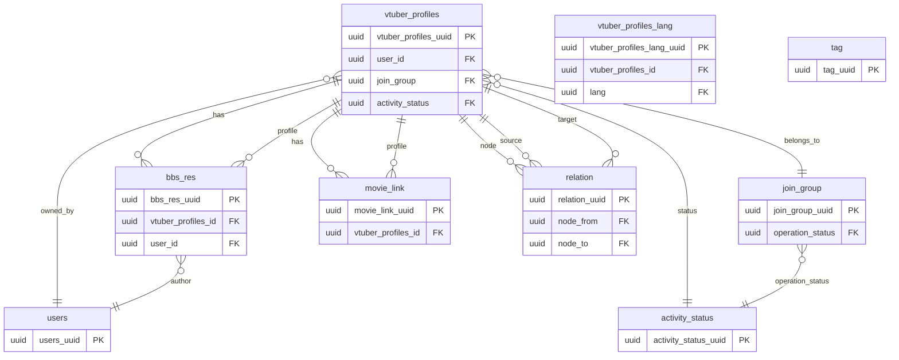
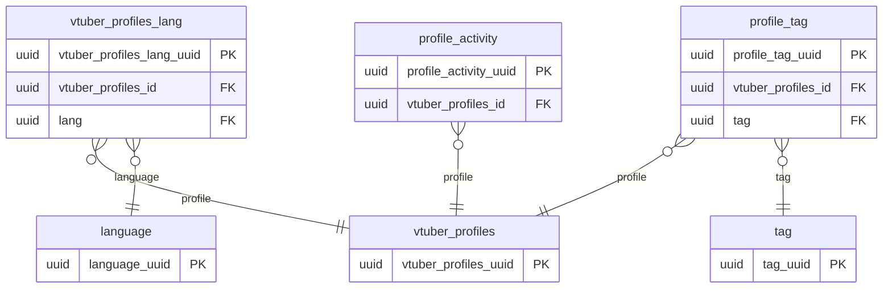
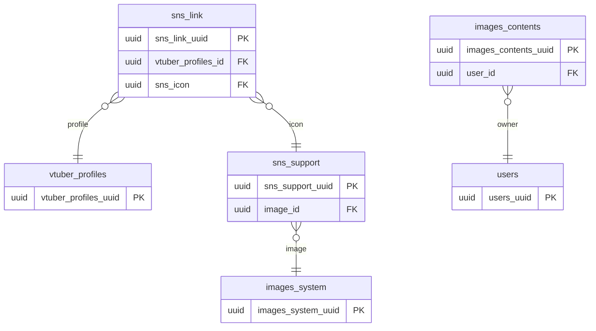
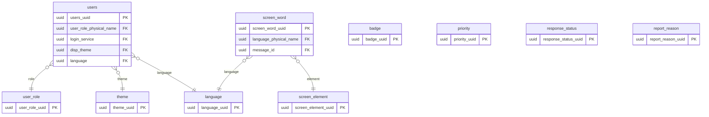
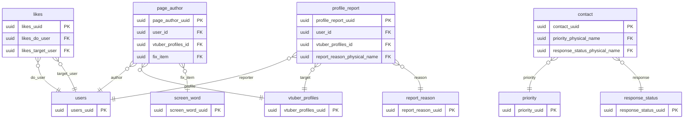

# DB設計ER図

MermaidのER図は向きを細かく制御しづらいため、結合の少ない領域ごとに分割しています。表示時は各図が縦に並ぶので、1枚の横長図より追いやすくなります。

## 1. VTuberプロフィール関連

```mermaid
erDiagram
    vtuber_profiles {
        uuid vtuber_profiles_uuid PK
        uuid user_id FK
        uuid join_group FK
        uuid activity_status FK
    }
    join_group {
        uuid join_group_uuid PK
        uuid operation_status FK
    }
    activity_status {
        uuid activity_status_uuid PK
    }
    users {
        uuid users_uuid PK
    }
    bbs_res {
        uuid bbs_res_uuid PK
        uuid vtuber_profiles_id FK
        uuid user_id FK
    }
    movie_link {
        uuid movie_link_uuid PK
        uuid vtuber_profiles_id FK
    }
    relation {
        uuid relation_uuid PK
        uuid node_from FK
        uuid node_to FK
    }
    vtuber_profiles_lang {
        uuid vtuber_profiles_lang_uuid PK
        uuid vtuber_profiles_id FK
        uuid lang FK
    }
    tag {
        uuid tag_uuid PK
    }

    vtuber_profiles ||--o{ bbs_res : has
    vtuber_profiles ||--o{ movie_link : has
    vtuber_profiles ||--o{ relation : node
    vtuber_profiles }o--|| users : owned_by
    vtuber_profiles }o--|| join_group : belongs_to
    vtuber_profiles }o--|| activity_status : status

    join_group }o--|| activity_status : operation_status

    bbs_res }o--|| vtuber_profiles : profile
    bbs_res }o--|| users : author

    movie_link }o--|| vtuber_profiles : profile

    relation }o--|| vtuber_profiles : source
    relation }o--|| vtuber_profiles : target
```

## 2. プロフィール拡張

```mermaid
erDiagram
    language {
        uuid language_uuid PK
    }
    vtuber_profiles {
        uuid vtuber_profiles_uuid PK
    }
    vtuber_profiles_lang {
        uuid vtuber_profiles_lang_uuid PK
        uuid vtuber_profiles_id FK
        uuid lang FK
    }
    tag {
        uuid tag_uuid PK
    }
    profile_tag {
        uuid profile_tag_uuid PK
        uuid vtuber_profiles_id FK
        uuid tag FK
    }
    profile_activity {
        uuid profile_activity_uuid PK
        uuid vtuber_profiles_id FK
    }

    vtuber_profiles_lang }o--|| vtuber_profiles : profile
    vtuber_profiles_lang }o--|| language : language

    profile_tag }o--|| vtuber_profiles : profile
    profile_tag }o--|| tag : tag

    profile_activity }o--|| vtuber_profiles : profile
```

## 3. SNS・画像

```mermaid
erDiagram
    vtuber_profiles {
        uuid vtuber_profiles_uuid PK
    }
    users {
        uuid users_uuid PK
    }
    sns_link {
        uuid sns_link_uuid PK
        uuid vtuber_profiles_id FK
        uuid sns_icon FK
    }
    sns_support {
        uuid sns_support_uuid PK
        uuid image_id FK
    }
    images_contents {
        uuid images_contents_uuid PK
        uuid user_id FK
    }
    images_system {
        uuid images_system_uuid PK
    }

    sns_link }o--|| vtuber_profiles : profile
    sns_link }o--|| sns_support : icon

    sns_support }o--|| images_system : image

    images_contents }o--|| users : owner
```

## 4. ユーザー・管理マスター

```mermaid
erDiagram
    users {
        uuid users_uuid PK
        uuid user_role_physical_name FK
        uuid login_service FK
        uuid disp_theme FK
        uuid language FK
    }
    user_role {
        uuid user_role_uuid PK
    }
    theme {
        uuid theme_uuid PK
    }
    language {
        uuid language_uuid PK
    }
    screen_element {
        uuid screen_element_uuid PK
    }
    screen_word {
        uuid screen_word_uuid PK
        uuid language_physical_name FK
        uuid message_id FK
    }
    badge {
        uuid badge_uuid PK
    }
    priority {
        uuid priority_uuid PK
    }
    response_status {
        uuid response_status_uuid PK
    }
    report_reason {
        uuid report_reason_uuid PK
    }

    users }o--|| user_role : role
    users }o--|| theme : theme
    users }o--|| language : language

    screen_word }o--|| language : language
    screen_word }o--|| screen_element : element
```

## 5. 通報・問い合わせ

```mermaid
erDiagram
    users {
        uuid users_uuid PK
    }
    vtuber_profiles {
        uuid vtuber_profiles_uuid PK
    }
    page_author {
        uuid page_author_uuid PK
        uuid user_id FK
        uuid vtuber_profiles_id FK
        uuid fix_item FK
    }
    screen_word {
        uuid screen_word_uuid PK
    }
    contact {
        uuid contact_uuid PK
        uuid priority_physical_name FK
        uuid response_status_physical_name FK
    }
    priority {
        uuid priority_uuid PK
    }
    response_status {
        uuid response_status_uuid PK
    }
    profile_report {
        uuid profile_report_uuid PK
        uuid user_id FK
        uuid vtuber_profiles_id FK
        uuid report_reason_physical_name FK
    }
    report_reason {
        uuid report_reason_uuid PK
    }
    likes {
        uuid likes_uuid PK
        uuid likes_do_user FK
        uuid likes_target_user FK
    }

    page_author }o--|| users : author
    page_author }o--|| vtuber_profiles : profile
    page_author }o--|| screen_word : fix_item

    contact }o--|| priority : priority
    contact }o--|| response_status : response

    profile_report }o--|| users : reporter
    profile_report }o--|| vtuber_profiles : target
    profile_report }o--|| report_reason : reason

    likes }o--|| users : do_user
    likes }o--|| users : target_user
```
