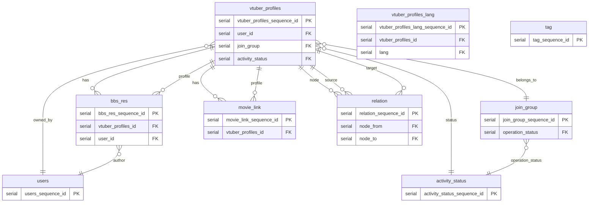
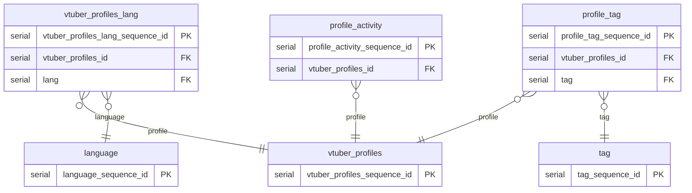
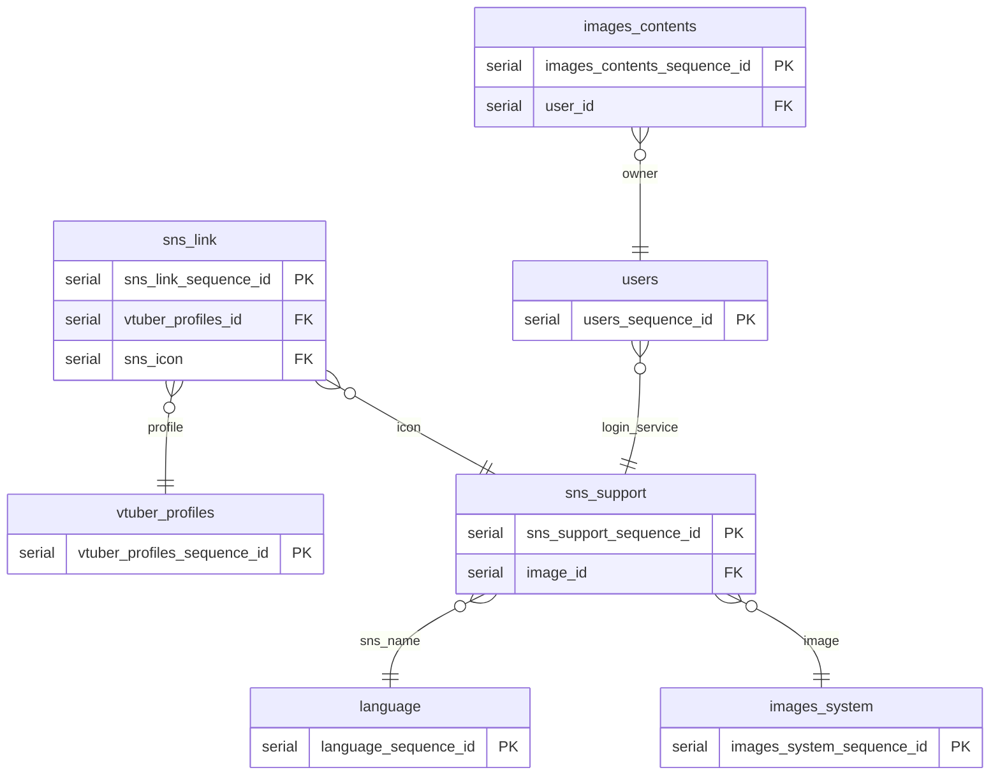
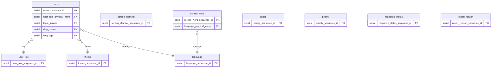
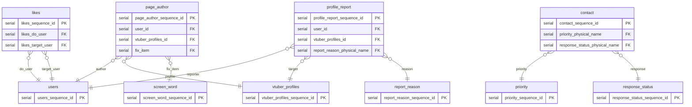

# DB設計ER図

## 1. VTuberプロフィール関連

```mermaid
erDiagram
    vtuber_profiles {
        serial vtuber_profiles_sequence_id PK
        serial user_id FK
        serial join_group FK
        serial activity_status FK
    }
    join_group {
        serial join_group_sequence_id PK
        serial operation_status FK
    }
    activity_status {
        serial activity_status_sequence_id PK
    }
    users {
        serial users_sequence_id PK
    }
    bbs_res {
        serial bbs_res_sequence_id PK
        serial vtuber_profiles_id FK
        serial user_id FK
    }
    movie_link {
        serial movie_link_sequence_id PK
        serial vtuber_profiles_id FK
    }
    relation {
        serial relation_sequence_id PK
        serial node_from FK
        serial node_to FK
    }
    vtuber_profiles_lang {
        serial vtuber_profiles_lang_sequence_id PK
        serial vtuber_profiles_id FK
        serial lang FK
    }
    tag {
        serial tag_sequence_id PK
    }

    vtuber_profiles ||--o{ bbs_res : has
    vtuber_profiles ||--o{ movie_link : has
    vtuber_profiles ||--o{ relation : node
    vtuber_profiles }o--|| users : owned_by
    vtuber_profiles }o--|| join_group : belongs_to
    vtuber_profiles }o--|| activity_status : status

    join_group }o--|| activity_status : operation_status

    bbs_res }o--|| vtuber_profiles : profile
    bbs_res }o--|| users : author

    movie_link }o--|| vtuber_profiles : profile

    relation }o--|| vtuber_profiles : source
    relation }o--|| vtuber_profiles : target
```

## 2. プロフィール拡張

```mermaid
erDiagram
    language {
        serial language_sequence_id PK
    }
    vtuber_profiles {
        serial vtuber_profiles_sequence_id PK
    }
    vtuber_profiles_lang {
        serial vtuber_profiles_lang_sequence_id PK
        serial vtuber_profiles_id FK
        serial lang FK
    }
    tag {
        serial tag_sequence_id PK
    }
    profile_tag {
        serial profile_tag_sequence_id PK
        serial vtuber_profiles_id FK
        serial tag FK
    }
    profile_activity {
        serial profile_activity_sequence_id PK
        serial vtuber_profiles_id FK
    }

    vtuber_profiles_lang }o--|| vtuber_profiles : profile
    vtuber_profiles_lang }o--|| language : language

    profile_tag }o--|| vtuber_profiles : profile
    profile_tag }o--|| tag : tag

    profile_activity }o--|| vtuber_profiles : profile
```

## 3. SNS・画像

```mermaid
erDiagram
    vtuber_profiles {
        serial vtuber_profiles_sequence_id PK
    }
    users {
        serial users_sequence_id PK
    }
    sns_link {
        serial sns_link_sequence_id PK
        serial vtuber_profiles_id FK
        serial sns_icon FK
    }
    sns_support {
        serial sns_support_sequence_id PK
        serial image_id FK
    }
    language {
        serial language_sequence_id PK
    }
    images_contents {
        serial images_contents_sequence_id PK
        serial user_id FK
    }
    images_system {
        serial images_system_sequence_id PK
    }

    sns_link }o--|| vtuber_profiles : profile
    sns_link }o--|| sns_support : icon

    sns_support }o--|| language : sns_name
    sns_support }o--|| images_system : image
    users }o--|| sns_support : login_service

    images_contents }o--|| users : owner
```

## 4. ユーザー・管理マスター

```mermaid
erDiagram
    users {
        serial users_sequence_id PK
        serial user_role_physical_name FK
        serial login_service FK
        serial disp_theme FK
        serial language FK
    }
    user_role {
        serial user_role_sequence_id PK
    }
    theme {
        serial theme_sequence_id PK
    }
    language {
        serial language_sequence_id PK
    }
    screen_element {
        serial screen_element_sequence_id PK
    }
    screen_word {
        serial screen_word_sequence_id PK
        serial language_physical_name FK
    }
    badge {
        serial badge_sequence_id PK
    }
    priority {
        serial priority_sequence_id PK
    }
    response_status {
        serial response_status_sequence_id PK
    }
    report_reason {
        serial report_reason_sequence_id PK
    }

    users }o--|| user_role : role
    users }o--|| theme : theme
    users }o--|| language : language

    screen_word }o--|| language : language
```

## 5. 通報・問い合わせ

```mermaid
erDiagram
    users {
        serial users_sequence_id PK
    }
    vtuber_profiles {
        serial vtuber_profiles_sequence_id PK
    }
    page_author {
        serial page_author_sequence_id PK
        serial user_id FK
        serial vtuber_profiles_id FK
        serial fix_item FK
    }
    screen_word {
        serial screen_word_sequence_id PK
    }
    contact {
        serial contact_sequence_id PK
        serial priority_physical_name FK
        serial response_status_physical_name FK
    }
    priority {
        serial priority_sequence_id PK
    }
    response_status {
        serial response_status_sequence_id PK
    }
    profile_report {
        serial profile_report_sequence_id PK
        serial user_id FK
        serial vtuber_profiles_id FK
        serial report_reason_physical_name FK
    }
    report_reason {
        serial report_reason_sequence_id PK
    }
    likes {
        serial likes_sequence_id PK
        serial likes_do_user FK
        serial likes_target_user FK
    }

    page_author }o--|| users : author
    page_author }o--|| vtuber_profiles : profile
    page_author }o--|| screen_word : fix_item

    contact }o--|| priority : priority
    contact }o--|| response_status : response

    profile_report }o--|| users : reporter
    profile_report }o--|| vtuber_profiles : target
    profile_report }o--|| report_reason : reason

    likes }o--|| users : do_user
    likes }o--|| users : target_user
```
