# DB設計たたき台（Excel転記版）

元ファイル: [.design/DB/DB設計たたき台.xlsx](.design/DB/DB設計たたき台.xlsx)

## 転記方針
- 1枚目の「テーブル一覧」はそのままMarkdown表にしています。
- 2枚目の詳細定義は、各テーブルごとに主要カラムと参照関係を整理しています。
- 3枚目の型一覧は、ER図作成時の参照補助として反映しています。
- 監査列は多くのテーブルで共通のため、各テーブルでは個別に書かず共通欄でまとめています。

## 共通監査列
- `create_datetime`: 作成日、既定値は `CURRENT_TIMESTAMP`
- `create_user`: 作成ユーザー、既定値は `CURRENT_USER`
- `update_datetime`: 更新日、既定値は `CURRENT_TIMESTAMP`
- `update_user`: 更新ユーザー、既定値は `CURRENT_USER`
- `soft_delete_flag`: 論理削除フラグ、既定値は `0`

## テーブル一覧

| No | 物理名 | 論理名 | 1レコード当たりの容量[bit] | 分類 | 説明 | 備考 |
|---|---|---|---:|---|---|---|
| 1 | vtuber_profiles | Vtuberプロフィール | 1288 | コンテンツ(動的) | プロフィール本体。特に言語に依存しないIDや数値、FKが設定してあるものなどトクゲンゴイゾンスウチセッテイ |  |
| 2 | join_group | 所属 | 1416 | コンテンツ(動的) | Vtuberの所属を管理する。ホロライブ、にじさんじ、個人勢など |  |
| 3 | tag | タグ | 776 | コンテンツ(動的) | ユーザーが任意でつけられるタグ。歌ってみた、ゲーム実況、ASMRなど |  |
| 4 | badge | バッジ | 1160 | システム管理(静的) | システム的に自動で付与されるバッジを管理する。よく見られているVtuber、新人Vtuber、最近更新されたVtuberなど |  |
| 5 | activity_status | 活動状態 | 904 | システム管理(静的) | Vtuber、所属の活動状態を管理する。準備中、活動中、休止中、卒業済みなど |  |
| 6 | sns_link | SNSリンク | 1288 | コンテンツ(動的) | プロフィールのSNSリンクを管理する。アイコン、ラベル、URLがあるため別テーブルになった |  |
| 7 | bbs_res | BBS | 1096 | コンテンツ(動的) | 各Vtuber詳細画面でのチャットのレスを管理。 |  |
| 8 | page_author | ページ編集者 | 1256 | コンテンツ(動的) | プロフィールの編集者を管理。編集内容も持つ。 |  |
| 9 | contact | 問い合わせ | 5112 | コンテンツ(動的) | ユーザーからの問い合わせ情報。問い合わせ内容や連絡先を管理 |  |
| 10 | priority | 優先度 | 904 | システム管理(静的) | 管理者向け。問い合わせに対する優先度を管理するためのステータス定義。最優先、優先度低など |  |
| 11 | response_status | 対応状況 | 904 | システム管理(静的) | 管理者向け。問い合わせに対する対応状況を管理するためのステータス定義。未対応、対応中など |  |
| 12 | language | 表示言語 | 1488 | システム管理(静的) | Webサイトが対応する言語の定義。 |  |
| 13 | screen_word | 画面文言 | 1032 | システム管理(静的) | 画面表示する単語全般やプルダウン、バッジなどの中身を定義する。表示言語ごとに用意する。画面要素x表示言語 |  |
| 14 | sns_support | サポートするSNS | 1104 | システム管理(静的) | Google,Tiktokなどについて、ログインに使用するサービスの有効無効、プロフィール画面のSNSリンク向けに、SNSのアイコンとサービス名、および有効無効、論理名、画像IDを管理 |  |
| 15 | profile_report | プロフィール通報 | 1224 | コンテンツ(動的) | ユーザーからの通報情報。どういった通報であるかを管理 |  |
| 16 | report_reason | 通報理由 | 1032 | システム管理(静的) | 通報の報告理由のプルダウン定義。 |  |
| 17 | users | ユーザー | 1936 | コンテンツ(動的) | Vtuber本人や管理者も含めたユーザー情報 |  |
| 18 | theme | 画面テーマ | 1032 | システム管理(静的) | サイト全体のテーマ設定。ライトテーマ、ダークテーマ、プロフィール帳テーマなど |  |
| 19 | user_role | ユーザー権限 | 904 | システム管理(静的) | ユーザーに紐づく権限。管理者、Vtuber、一般など |  |
| 20 | images_contents | 画像(ユーザー投稿) | 12496 | コンテンツ(動的) | Vtuberのサムネイル画像など保管するCloud Storage(GCS)へのURLを管理する |  |
| 21 | images_system | 画像(システム管理) | 12368 | システム管理(静的) | アイコン画像などのシステム固定の画像を保管するCloud Storage(GCS)へのURLを管理する |  |
| 22 | screen_element | 画面要素 | 904 | システム管理(静的) | 画面要素名の一覧を管理する |  |
| 23 | likes | いいね | 1096 | コンテンツ(動的) | ユーザーからユーザーへのいいねを管理する |  |
| 24 | movie_link | 動画リンク | 968 | コンテンツ(動的) | プロフィールにリンクされる動画を管理する |  |
| 25 | relation | 関係値 | 1288 | コンテンツ(動的) | 相関図に使用するプロフィール間の関係値（ノード）を管理する |  |
| 26 | vtuber_profiles_lang | Vtuberプロフィール(各言語) | 6152 | コンテンツ(動的) | プロフィール本体。特に言語に依存する項目トクゲンゴイゾンコウモク |  |
| 27 | profile_tag | プロフィールのタグ | 1032 | コンテンツ(動的) | プロフィールに紐づくタグを管理する |  |
| 28 | profile_activity | プロフィールの活動ジャンル | 1032 | コンテンツ(動的) | プロフィールに紐づく活動ジャンルを管理する |  |

## テーブル定義詳細

### vtuber_profiles
- 主キー: `vtuber_profiles_uuid` (uuid, default `gen_random_uuid()`)
- `vtuber_profiles_id`: VプロフィールID、varchar(8)、URLで使用
- `user_id`: ユーザーID、`users.users_uuid` 参照
- `join_group`: 所属、`join_group.join_group_uuid` 参照
- `debut_date`: デビュー日、timestamptz
- `activity_status`: 活動状態、`activity_status.activity_status_uuid` 参照
- 監査列: 共通監査列を使用

### join_group
- 主キー: `join_group_uuid` (uuid, default `gen_random_uuid()`)
- `group_name`: 所属名、varchar(64)
- `operation_status`: 運営状態、`activity_status.activity_status_uuid` 参照
- `group_detail`: 所属説明、text
- 監査列: 共通監査列を使用

### tag
- 主キー: `tag_uuid` (uuid, default `gen_random_uuid()`)
- `tag`: タグ名、text
- 監査列: 共通監査列を使用

### badge
- 主キー: `badge_uuid` (uuid, default `gen_random_uuid()`)
- `badge_physical_name`: バッジ名(物理名)、varchar(24)
- `badge_logical_name`: バッジ名(論理名)、varchar(24)
- 監査列: 共通監査列を使用

### activity_status
- 主キー: `activity_status_uuid` (uuid, default `gen_random_uuid()`)
- `activity_status_physical_name`: 活動状態名(物理名)、varchar(8)
- `activity_status_logical_name`: 活動状態名(論理名)、varchar(8)
- 監査列: 共通監査列を使用

### sns_link
- 主キー: `sns_link_uuid` (uuid, default `gen_random_uuid()`)
- `vtuber_profiles_id`: `vtuber_profiles.vtuber_profiles_uuid` 参照
- `sns_icon`: `sns_support.sns_support_uuid` 参照、選択なしも許容
- `sns_link_label`: ラベル名、varchar(32)
- `sns_url`: URL、text
- 監査列: 共通監査列を使用

### bbs_res
- 主キー: `bbs_res_uuid` (uuid, default `gen_random_uuid()`)
- `vtuber_profiles_id`: `vtuber_profiles.vtuber_profiles_uuid` 参照
- `user_id`: `users.users_uuid` 参照
- `res_text`: レス内容、text
- `res_datetime`: 投稿日時時刻、timestamptz
- 監査列: 共通監査列を使用

### page_author
- 主キー: `page_author_uuid` (uuid, default `gen_random_uuid()`)
- `user_id`: `users.users_uuid` 参照
- `vtuber_profiles_id`: `vtuber_profiles.vtuber_profiles_uuid` 参照
- `fix_item`: `screen_word.screen_word_uuid` 参照
- `fix_before`: 修正前、text
- `fix_after`: 修正後、text
- `fix_datetime`: 修正日時、timestamptz
- `report_count`: 通報数、integer、default `0`
- 監査列: 共通監査列を使用

### contact
- 主キー: `contact_uuid` (uuid, default `gen_random_uuid()`)
- `mail_address`: メールアドレス、varchar(255)
- `subject`: 件名、varchar(255)
- `contact_detail`: 問い合わせ内容、text
- `priority_physical_name`: `priority.priority_uuid` 参照
- `response_status_physical_name`: `response_status.response_status_uuid` 参照
- 監査列: 共通監査列を使用

### priority
- 主キー: `priority_uuid` (uuid, default `gen_random_uuid()`)
- `priority_physical_name`: 優先度(物理名)、varchar(8)
- `priority_logical_name`: 優先度(論理名)、varchar(8)
- 監査列: 共通監査列を使用

### response_status
- 主キー: `response_status_uuid` (uuid, default `gen_random_uuid()`)
- `response_status_physical_name`: 対応状況(物理名)、varchar(8)
- `response_status_logical_name`: 対応状況(論理名)、varchar(8)
- 監査列: 共通監査列を使用

### language
- 主キー: `language_uuid` (uuid, default `gen_random_uuid()`)
- `language_physical_name`: 表示言語(物理名)、varchar(16)
- `language_logical_name`: 表示言語(論理名)、varchar(64)
- `language_image`: 言語画像、bigserial
- `enable`: 有効フラグ、boolean、default `0`
- 監査列: 共通監査列を使用

### screen_word
- 主キー: `screen_word_uuid` (uuid, default `gen_random_uuid()`)
- `language_physical_name`: `language.language_uuid` 参照
- `message_id`: `screen_element.screen_element_uuid` 参照
- `display_message`: 文言、text
- 監査列: 共通監査列を使用

### sns_support
- 主キー: `sns_support_uuid` (uuid, default `gen_random_uuid()`)
- `sns_name_physical_name`: サービス名(物理名)、varchar(9)
- `sns_name_logical_name`: サービス名(論理名)、varchar(14)
- `image_id`: `images_system.images_system_uuid` 参照
- `use_login_service`: ログインサービス有効フラグ、boolean、default `1`
- `use_sns_link`: SNSリンク有効フラグ、boolean、default `1`
- 監査列: 共通監査列を使用

### profile_report
- 主キー: `profile_report_uuid` (uuid, default `gen_random_uuid()`)
- `user_id`: `users.users_uuid` 参照
- `vtuber_profiles_id`: `vtuber_profiles.vtuber_profiles_uuid` 参照
- `report_reason_physical_name`: `report_reason.report_reason_uuid` 参照
- `report_detail`: 詳細、text
- `report_datetime`: 通報日時、timestamptz、default `CURRENT_TIMESTAMP`
- 監査列: 共通監査列を使用

### report_reason
- 主キー: `report_reason_uuid` (uuid, default `gen_random_uuid()`)
- `report_reason_physical_name`: 通報理由(物理名)、varchar(16)
- `report_reason_logical_name`: 通報理由(論理名)、varchar(16)
- 監査列: 共通監査列を使用

### users
- 主キー: `users_uuid` (uuid, default `gen_random_uuid()`)
- `user_id`: ユーザーID、varchar(8)、自動払い出し
- `user_name`: ユーザー名、varchar(64)
- `user_role_physical_name`: `user_role.user_role_uuid` 参照
- `user_name_hidden_flag`: 画面非表示フラグ、boolean、default `0`
- `login_service`: `sns_support.sns_support_uuid` 参照
- `register_date`: 登録日、timestamptz、default `CURRENT_TIMESTAMP`
- `disp_theme`: `theme.theme_uuid` 参照、default `"default"`
- `language`: `language.language_uuid` 参照、default `"japan"`
- 監査列: 共通監査列を使用

### theme
- 主キー: `theme_uuid` (uuid, default `gen_random_uuid()`)
- `theme_physical_name`: 画面テーマ(物理名)、varchar(16)
- `theme_logical_name`: 画面テーマ(論理名)、varchar(16)
- 監査列: 共通監査列を使用

### user_role
- 主キー: `user_role_uuid` (uuid, default `gen_random_uuid()`)
- `user_role_physical_name`: ユーザー権限(物理名)、varchar(8)
- `user_role_logical_name`: ユーザー権限(論理名)、varchar(8)
- 監査列: 共通監査列を使用

### images_contents
- 主キー: `images_contents_uuid` (uuid, default `gen_random_uuid()`)
- `image_id`: 画像ID、bigserial
- `user_id`: `users.users_uuid` 参照
- `gcs_bucket`: バケット名、varchar(100)
- `gcs_object_name`: オブジェクトパス、varchar(512)
- `cdn_url`: CDNのURL、varchar(512)
- `content_type`: コンテンツタイプ(拡張子等)、varchar(50)
- `width`: 画像幅、integer
- `height`: 画像高、integer
- `file_size`: ファイルサイズ、integer
- `alt_text`: 付加テキスト、varchar(255)
- 監査列: 共通監査列を使用

### images_system
- 主キー: `images_system_uuid` (uuid, default `gen_random_uuid()`)
- `image_id`: 画像ID、bigserial
- `gcs_bucket`: バケット名、varchar(100)
- `gcs_object_name`: オブジェクトパス、varchar(512)
- `cdn_url`: CDNのURL、varchar(512)
- `content_type`: コンテンツタイプ(拡張子等)、varchar(50)
- `width`: 画像幅、integer
- `height`: 画像高、integer
- `file_size`: ファイルサイズ、integer
- `alt_text`: 付加テキスト、varchar(255)
- 監査列: 共通監査列を使用

### screen_element
- 主キー: `screen_element_uuid` (uuid, default `gen_random_uuid()`)
- `message_id`: メッセージID、varchar(16)
- 監査列: 共通監査列を使用

### likes
- 主キー: `likes_uuid` (uuid, default `gen_random_uuid()`)
- `likes_do_user`: `users.users_uuid` 参照
- `likes_target_user`: `users.users_uuid` 参照
- `likes_type`: いいね種別、enum
- `likes_datetime`: いいねした日、timestamptz
- 監査列: 共通監査列を使用

### movie_link
- 主キー: `movie_link_uuid` (uuid, default `gen_random_uuid()`)
- `movie_id`: 動画ID、bigserial
- `vtuber_profiles_id`: `vtuber_profiles.vtuber_profiles_uuid` 参照
- `url`: 動画URL、text
- 監査列: 共通監査列を使用

### relation
- 主キー: `relation_uuid` (uuid, default `gen_random_uuid()`)
- `node_from`: `vtuber_profiles.vtuber_profiles_uuid` 参照
- `node_to`: `vtuber_profiles.vtuber_profiles_uuid` 参照
- `node_name`: 関係名、varchar(32)
- 監査列: 共通監査列を使用

### vtuber_profiles_lang
- 主キー: `vtuber_profiles_lang_uuid` (uuid, default `gen_random_uuid()`)
- `vtuber_profiles_id`: `vtuber_profiles.vtuber_profiles_uuid` 参照
- `lang`: `language.language_uuid` 参照
- `name`: 名前、varchar(128)
- `nickname`: ニックネーム、varchar(128)
- `birthday`: 誕生日、varchar(32)
- `blood_type`: 血液型、varchar(16)
- `height`: 身長、varchar(16)
- `mutter`: ひとこと、text
- `catchphrase`: キャッチフレーズ、varchar(64)
- `favorite`: 好きなもの、varchar(64)
- `dis_favorite`: 苦手なもの、varchar(64)
- `hobby`: 趣味・特技、varchar(64)
- `dream`: 将来の夢、varchar(64)
- `messages`: メッセージ、text
- `profile_detail`: プロフィール詳細、text
- 監査列: 共通監査列を使用

### profile_tag
- 主キー: `profile_tag_uuid` (uuid, default `gen_random_uuid()`)
- `vtuber_profiles_id`: `vtuber_profiles.vtuber_profiles_uuid` 参照
- `tag`: `tag.tag_uuid` 参照
- 監査列: 共通監査列を使用

### profile_activity
- 主キー: `profile_activity_uuid` (uuid, default `gen_random_uuid()`)
- `vtuber_profiles_id`: `vtuber_profiles.vtuber_profiles_uuid` 参照
- `activity`: 活動ジャンル、varchar(16)
- 監査列: 共通監査列を使用

## ER図

```mermaid
erDiagram
    vtuber_profiles {
        uuid vtuber_profiles_uuid PK
        uuid user_id FK
        uuid join_group FK
        uuid activity_status FK
    }
    join_group {
        uuid join_group_uuid PK
        uuid operation_status FK
    }
    tag {
        uuid tag_uuid PK
    }
    badge {
        uuid badge_uuid PK
    }
    activity_status {
        uuid activity_status_uuid PK
    }
    sns_link {
        uuid sns_link_uuid PK
        uuid vtuber_profiles_id FK
        uuid sns_icon FK
    }
    bbs_res {
        uuid bbs_res_uuid PK
        uuid vtuber_profiles_id FK
        uuid user_id FK
    }
    page_author {
        uuid page_author_uuid PK
        uuid user_id FK
        uuid vtuber_profiles_id FK
        uuid fix_item FK
    }
    contact {
        uuid contact_uuid PK
        uuid priority_physical_name FK
        uuid response_status_physical_name FK
    }
    priority {
        uuid priority_uuid PK
    }
    response_status {
        uuid response_status_uuid PK
    }
    language {
        uuid language_uuid PK
    }
    screen_word {
        uuid screen_word_uuid PK
        uuid language_physical_name FK
        uuid message_id FK
    }
    sns_support {
        uuid sns_support_uuid PK
        uuid image_id FK
    }
    profile_report {
        uuid profile_report_uuid PK
        uuid user_id FK
        uuid vtuber_profiles_id FK
        uuid report_reason_physical_name FK
    }
    report_reason {
        uuid report_reason_uuid PK
    }
    users {
        uuid users_uuid PK
        uuid user_role_physical_name FK
        uuid login_service FK
        uuid disp_theme FK
        uuid language FK
    }
    theme {
        uuid theme_uuid PK
    }
    user_role {
        uuid user_role_uuid PK
    }
    images_contents {
        uuid images_contents_uuid PK
        uuid user_id FK
    }
    images_system {
        uuid images_system_uuid PK
    }
    screen_element {
        uuid screen_element_uuid PK
    }
    likes {
        uuid likes_uuid PK
        uuid likes_do_user FK
        uuid likes_target_user FK
    }
    movie_link {
        uuid movie_link_uuid PK
        uuid vtuber_profiles_id FK
    }
    relation {
        uuid relation_uuid PK
        uuid node_from FK
        uuid node_to FK
    }
    vtuber_profiles_lang {
        uuid vtuber_profiles_lang_uuid PK
        uuid vtuber_profiles_id FK
        uuid lang FK
    }
    profile_tag {
        uuid profile_tag_uuid PK
        uuid vtuber_profiles_id FK
        uuid tag FK
    }
    profile_activity {
        uuid profile_activity_uuid PK
        uuid vtuber_profiles_id FK
    }

    vtuber_profiles ||--o{ sns_link : has
    vtuber_profiles ||--o{ bbs_res : has
    vtuber_profiles ||--o{ page_author : has
    vtuber_profiles ||--o{ profile_report : has
    vtuber_profiles ||--o{ movie_link : has
    vtuber_profiles ||--o{ relation : node_from
    vtuber_profiles ||--o{ relation : node_to
    vtuber_profiles ||--o{ vtuber_profiles_lang : has
    vtuber_profiles ||--o{ profile_tag : has
    vtuber_profiles ||--o{ profile_activity : has
    vtuber_profiles }o--|| users : owned_by
    vtuber_profiles }o--|| join_group : belongs_to
    vtuber_profiles }o--|| activity_status : status

    join_group }o--|| activity_status : operation_status

    sns_link }o--|| vtuber_profiles : profile
    sns_link }o--|| sns_support : icon

    bbs_res }o--|| vtuber_profiles : profile
    bbs_res }o--|| users : author

    page_author }o--|| users : author
    page_author }o--|| vtuber_profiles : profile
    page_author }o--|| screen_word : fix_item

    contact }o--|| priority : priority
    contact }o--|| response_status : response

    screen_word }o--|| language : language
    screen_word }o--|| screen_element : element

    sns_support }o--|| images_system : image

    profile_report }o--|| users : reporter
    profile_report }o--|| vtuber_profiles : target
    profile_report }o--|| report_reason : reason

    users }o--|| user_role : role
    users }o--|| sns_support : login_service
    users }o--|| theme : theme
    users }o--|| language : language

    images_contents }o--|| users : owner

    likes }o--|| users : do_user
    likes }o--|| users : target_user

    movie_link }o--|| vtuber_profiles : profile

    relation }o--|| vtuber_profiles : source
    relation }o--|| vtuber_profiles : target

    vtuber_profiles_lang }o--|| vtuber_profiles : profile
    vtuber_profiles_lang }o--|| language : language

    profile_tag }o--|| vtuber_profiles : profile
    profile_tag }o--|| tag : tag

    profile_activity }o--|| vtuber_profiles : profile
```

