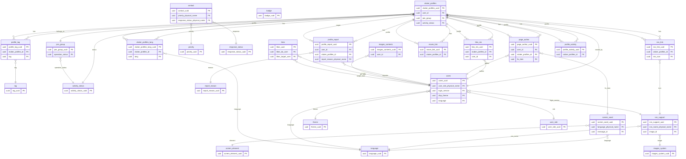

# DB設計たたき台（Excel転記版）

元ファイル: [.design/DB/DB設計たたき台.xlsx](.design/DB/DB設計たたき台.xlsx)

## 転記方針
- 1枚目の「テーブル一覧」はそのままMarkdown表にしています。
- 2枚目の詳細定義は、各テーブルごとに主要カラムと参照関係を整理しています。
- 3枚目の型一覧は、ER図作成時の参照補助として反映しています。
- 監査列は多くのテーブルで共通のため、各テーブルでは個別に書かず共通欄でまとめています。

## 共通監査列

| カラム物理名 | カラム論理名 | 型 | 既定値 | 非NULL | Unique | 備考 |
|---|---|---|---|---|---|---|
| create_datetime | 作成日 | timestamptz | CURRENT_TIMESTAMP | x |  |  |
| create_user | 作成ユーザー | varchar(32) | CURRENT_USER | x |  | 物理名を保存 |
| update_datetime | 更新日 | timestamptz | CURRENT_TIMESTAMP | x |  |  |
| update_user | 更新ユーザー | varchar(32) | CURRENT_USER | x |  | 物理名を保存 |
| soft_delete_flag | 論理削除フラグ | boolean | 0 | x |  |  |

## テーブル一覧

| No | 物理名 | 論理名 | 分類 | 説明 |
|---|---|---|---|---|
| 1 | vtuber_profiles | Vtuberプロフィール | コンテンツ(動的) | プロフィール本体。特に言語に依存しないIDや数値、FKが設定してあるものなど |
| 2 | join_group | 所属 | コンテンツ(動的) | Vtuberの所属を管理する。ホロライブ、にじさんじ、個人勢など |
| 3 | tag | タグ | コンテンツ(動的) | ユーザーが任意でつけられるタグ。歌ってみた、ゲーム実況、ASMRなど |
| 4 | badge | バッジ | システム管理(静的) | システム的に自動で付与されるバッジを管理する。よく見られているVtuber、新人Vtuber、最近更新されたVtuberなど |
| 5 | activity_status | 活動状態 | システム管理(静的) | Vtuber、所属の活動状態を管理する。準備中、活動中、休止中、卒業済みなど |
| 6 | sns_link | SNSリンク | コンテンツ(動的) | プロフィールのSNSリンクを管理する。アイコン、ラベル、URLがあるため別テーブルになった |
| 7 | bbs_res | BBS | コンテンツ(動的) | 各Vtuber詳細画面でのチャットのレスを管理。 |
| 8 | page_author | ページ編集者 | コンテンツ(動的) | プロフィールの編集者を管理。編集内容も持つ。 |
| 9 | contact | 問い合わせ | コンテンツ(動的) | ユーザーからの問い合わせ情報。問い合わせ内容や連絡先を管理 |
| 10 | priority | 優先度 | システム管理(静的) | 管理者向け。問い合わせに対する優先度を管理するためのステータス定義。最優先、優先度低など |
| 11 | response_status | 対応状況 | システム管理(静的) | 管理者向け。問い合わせに対する対応状況を管理するためのステータス定義。未対応、対応中など |
| 12 | language | 表示言語 | システム管理(静的) | Webサイトが対応する言語の定義。 |
| 13 | screen_word | 画面文言 | システム管理(静的) | 画面表示する単語全般やプルダウン、バッジなどの中身を定義する。表示言語ごとに用意する。画面要素x表示言語 |
| 14 | sns_support | サポートするSNS | システム管理(静的) | Google,Tiktokなどについて、ログインに使用するサービスの有効無効、プロフィール画面のSNSリンク向けに、SNSのアイコンとサービス名、および有効無効、論理名、画像IDを管理 |
| 15 | profile_report | プロフィール通報 | コンテンツ(動的) | ユーザーからの通報情報。どういった通報であるかを管理 |
| 16 | report_reason | 通報理由 | システム管理(静的) | 通報の報告理由のプルダウン定義。 |
| 17 | users | ユーザー | コンテンツ(動的) | Vtuber本人や管理者も含めたユーザー情報 |
| 18 | theme | 画面テーマ | システム管理(静的) | サイト全体のテーマ設定。ライトテーマ、ダークテーマ、プロフィール帳テーマなど |
| 19 | user_role | ユーザー権限 | システム管理(静的) | ユーザーに紐づく権限。管理者、Vtuber、一般など |
| 20 | images_contents | 画像(ユーザー投稿) | コンテンツ(動的) | Vtuberのサムネイル画像など保管するCloud Storage(GCS)へのURLを管理する |
| 21 | images_system | 画像(システム管理) | システム管理(静的) | アイコン画像などのシステム固定の画像を保管するCloud Storage(GCS)へのURLを管理する |
| 22 | screen_element | 画面要素 | システム管理(静的) | 画面要素名の一覧を管理する |
| 23 | likes | いいね | コンテンツ(動的) | ユーザーからユーザーへのいいねを管理する |
| 24 | movie_link | 動画リンク | コンテンツ(動的) | プロフィールにリンクされる動画を管理する |
| 25 | relation | 関係値 | コンテンツ(動的) | 相関図に使用するプロフィール間の関係値（ノード）を管理する |
| 26 | vtuber_profiles_lang | Vtuberプロフィール(各言語) | コンテンツ(動的) | プロフィール本体。特に言語に依存する項目 |
| 27 | profile_tag | プロフィールのタグ | コンテンツ(動的) | プロフィールに紐づくタグを管理する |
| 28 | profile_activity | プロフィールの活動ジャンル | コンテンツ(動的) | プロフィールに紐づく活動ジャンルを管理する |

## テーブル定義詳細

### vtuber_profiles（Vtuberプロフィール）

| No | カラム物理名 | カラム論理名 | 型 | PK | FK | FK参照先 | 非NULL | Unique | デフォルト | 備考 |
|---:|---|---|---|---|---|---|---|---|---|---|
| 1 | vtuber_profiles_uuid | UUID | uuid | x |  |  | x(PK制約) | x(PK制約) | gen_random_uuid() |  |
| 2 | vtuber_profiles_id | VプロフィールID | varchar(8) |  |  |  | x | x |  | URLに使用する（DB連携はUUIDで管理 |
| 3 | user_id | ユーザーID | uuid |  | x | users.users_uuid |  |  |  |  |
| 4 | join_group | 所属 | uuid |  | x | join_group.join_group_uuid |  |  |  |  |
| 5 | debut_date | デビュー日 | timestamptz |  |  |  |  |  |  |  |
| 6 | activity_status | 活動状態 | uuid |  | x | activity_status.activity_status_uuid | x |  |  |  |

### join_group（所属）

| No | カラム物理名 | カラム論理名 | 型 | PK | FK | FK参照先 | 非NULL | Unique | デフォルト | 備考 |
|---:|---|---|---|---|---|---|---|---|---|---|
| 1 | join_group_uuid | UUID | uuid | x |  |  | x(PK制約) | x(PK制約) | gen_random_uuid() |  |
| 2 | group_name | 所属名 | varchar(64) |  |  |  | x | x |  |  |
| 3 | operation_status | 運営状態 | uuid |  | x | activity_status.activity_status_uuid |  |  |  |  |
| 4 | group_detail | 所属説明 | text |  |  |  |  |  |  |  |

### tag（タグ）

| No | カラム物理名 | カラム論理名 | 型 | PK | FK | FK参照先 | 非NULL | Unique | デフォルト | 備考 |
|---:|---|---|---|---|---|---|---|---|---|---|
| 1 | tag_uuid | UUID | uuid | x |  |  | x(PK制約) | x(PK制約) | gen_random_uuid() |  |
| 2 | tag | タグ名 | text |  |  |  | x | x |  |  |

### badge（バッジ）

| No | カラム物理名 | カラム論理名 | 型 | PK | FK | FK参照先 | 非NULL | Unique | デフォルト | 備考 |
|---:|---|---|---|---|---|---|---|---|---|---|
| 1 | badge_uuid | UUID | uuid | x |  |  | x(PK制約) | x(PK制約) | gen_random_uuid() |  |
| 2 | badge_physical_name | バッジ名(物理名) | varchar(24) |  |  |  | x | x |  | 論理名はscreen_wordテーブルで管理する。具体的な要素の候補：よく見られているVtuber、新人Vtuber、最近更新されたVTuber |

### activity_status（活動状態）

| No | カラム物理名 | カラム論理名 | 型 | PK | FK | FK参照先 | 非NULL | Unique | デフォルト | 備考 |
|---:|---|---|---|---|---|---|---|---|---|---|
| 1 | activity_status_uuid | UUID | uuid | x |  |  | x(PK制約) | x(PK制約) | gen_random_uuid() |  |
| 2 | activity_status_physical_name | 活動状態名(物理名) | varchar(8) |  |  |  | x | x |  | 論理名はscreen_wordテーブルで管理する。具体的な要素の候補：活動開始前(VTuber準備中)、活動中、卒業済み |

### sns_link（SNSリンク）

| No | カラム物理名 | カラム論理名 | 型 | PK | FK | FK参照先 | 非NULL | Unique | デフォルト | 備考 |
|---:|---|---|---|---|---|---|---|---|---|---|
| 1 | sns_link_uuid | UUID | uuid | x |  |  | x(PK制約) | x(PK制約) | gen_random_uuid() |  |
| 2 | vtuber_profiles_id | VプロフィールID | uuid |  | x | vtuber_profiles.vtuber_profiles_uuid | x |  |  |  |
| 3 | sns_icon | SNSアイコン | uuid |  | x | sns_support.sns_support_uuid |  |  |  | 選択なしも含む |
| 4 | sns_link_label | ラベル名 | varchar(32) |  |  |  |  |  | SNSアイコンに紐づくSNS名 |  |
| 5 | sns_url | URL | text |  |  |  | x |  |  |  |

### bbs_res（BBS）

| No | カラム物理名 | カラム論理名 | 型 | PK | FK | FK参照先 | 非NULL | Unique | デフォルト | 備考 |
|---:|---|---|---|---|---|---|---|---|---|---|
| 1 | bbs_res_uuid | UUID | uuid | x |  |  | x(PK制約) | x(PK制約) | gen_random_uuid() |  |
| 2 | vtuber_profiles_id | VプロフィールID | uuid |  | x | vtuber_profiles.vtuber_profiles_uuid | x |  |  |  |
| 3 | user_id | ユーザーID | uuid |  | x | users.users_uuid | x |  |  |  |
| 4 | res_text | レス内容 | text |  |  |  | x |  |  |  |
| 5 | res_datetime | 投稿日時時刻 | timestamptz |  |  |  | x |  |  |  |

### page_author（ページ編集者）

| No | カラム物理名 | カラム論理名 | 型 | PK | FK | FK参照先 | 非NULL | Unique | デフォルト | 備考 |
|---:|---|---|---|---|---|---|---|---|---|---|
| 1 | page_author_uuid | UUID | uuid | x |  |  | x(PK制約) | x(PK制約) | gen_random_uuid() |  |
| 2 | user_id | ユーザーID | uuid |  | x | users.users_uuid | x |  |  |  |
| 3 | vtuber_profiles_id | ユーザーID | uuid |  | x | vtuber_profiles.vtuber_profiles_uuid | x |  |  |  |
| 4 | fix_item | 修正項目 | uuid |  | x | screen_word.screen_word_uuid | x |  |  |  |
| 5 | fix_before | 修正前 | text |  |  |  | x |  |  |  |
| 6 | fix_after | 修正後 | text |  |  |  | x |  |  |  |
| 7 | fix_datetime | 修正日時 | timestamptz |  |  |  | x |  | CURRENT_TIMESTAMP |  |
| 8 | report_count | 通報数 | integer |  |  |  | x |  | 0 |  |

### contact（問い合わせ）

| No | カラム物理名 | カラム論理名 | 型 | PK | FK | FK参照先 | 非NULL | Unique | デフォルト | 備考 |
|---:|---|---|---|---|---|---|---|---|---|---|
| 1 | contact_uuid | UUID | uuid | x |  |  | x(PK制約) | x(PK制約) | gen_random_uuid() |  |
| 2 | mail_address | メールアドレス | varchar(255) |  |  |  | x |  |  |  |
| 3 | subject | 件名 | varchar(255) |  |  |  | x |  |  |  |
| 4 | contact_detail | 問い合わせ内容 | text |  |  |  | x |  |  |  |
| 5 | priority_physical_name | 優先度(物理名) | uuid |  | x | priority.priority_uuid |  |  |  |  |
| 6 | response_status_physical_name | 対応状況(物理名) | uuid |  | x | response_status.response_status_uuid |  |  |  |  |

### priority（優先度）

| No | カラム物理名 | カラム論理名 | 型 | PK | FK | FK参照先 | 非NULL | Unique | デフォルト | 備考 |
|---:|---|---|---|---|---|---|---|---|---|---|
| 1 | priority_uuid | UUID | uuid | x |  |  | x(PK制約) | x(PK制約) | gen_random_uuid() |  |
| 2 | priority_physical_name | 優先度(物理名) | varchar(8) |  |  |  | x | x |  |  |
| 3 | priority_logical_name | 優先度(論理名) | varchar(8) |  |  |  |  |  |  | 管理者向けのため、日本語固定 |

### response_status（対応状況）

| No | カラム物理名 | カラム論理名 | 型 | PK | FK | FK参照先 | 非NULL | Unique | デフォルト | 備考 |
|---:|---|---|---|---|---|---|---|---|---|---|
| 1 | response_status_uuid | UUID | uuid | x |  |  | x(PK制約) | x(PK制約) | gen_random_uuid() |  |
| 2 | response_status_physical_name | 対応状況(物理名) | varchar(8) |  |  |  | x | x |  |  |
| 3 | response_status_logical_name | 対応状況(論理名) | varchar(8) |  |  |  |  |  |  | 管理者向けのため、日本語固定 |

### language（表示言語）

| No | カラム物理名 | カラム論理名 | 型 | PK | FK | FK参照先 | 非NULL | Unique | デフォルト | 備考 |
|---:|---|---|---|---|---|---|---|---|---|---|
| 1 | language_uuid | UUID | uuid | x |  |  | x(PK制約) | x(PK制約) | gen_random_uuid() |  |
| 2 | language_physical_name | 表示言語(物理名) | varchar(16) |  |  |  | x | x |  | 論理名はscreen_wordテーブルで管理する |
| 4 | language_image | 言語画像 | bigserial |  |  |  |  |  |  | SVG |
| 5 | enable | 有効フラグ | boolean |  |  |  | x |  | 0 |  |

### screen_word（画面文言）

| No | カラム物理名 | カラム論理名 | 型 | PK | FK | FK参照先 | 非NULL | Unique | デフォルト | 備考 |
|---:|---|---|---|---|---|---|---|---|---|---|
| 1 | screen_word_uuid | UUID | uuid | x |  |  | x(PK制約) | x(PK制約) | gen_random_uuid() |  |
| 2 | language_physical_name | 表示言語(物理名) | uuid |  | x | language.language_uuid |  |  |  |  |
| 3 | message_id | メッセージID | uuid |  | x | screen_element.screen_element_uuid |  |  |  |  |
| 4 | display_message | 文言 | text |  |  |  |  |  |  |  |
| 5 | message_type | 文言種別 | enum |  |  |  |  |  |  | "screen_element","other_tables" |

### sns_support（サポートするSNS）

| No | カラム物理名 | カラム論理名 | 型 | PK | FK | FK参照先 | 非NULL | Unique | デフォルト | 備考 |
|---:|---|---|---|---|---|---|---|---|---|---|
| 1 | sns_support_uuid | UUID | uuid | x |  |  | x(PK制約) | x(PK制約) | gen_random_uuid() |  |
| 2 | sns_name_physical_name | サービス名(物理名) | uuid |  | x | language.language_uuid | x | x |  |  |
| 4 | image_id | 画像ID | uuid |  | x | images_system.images_system_uuid | x |  |  | SVG形式 |
| 5 | use_login_service | ログインサービス有効フラグ | boolean |  |  |  | x |  | 1 |  |
| 6 | use_sns_link | SNSリンク有効フラグ | boolean |  |  |  | x |  | 1 |  |

### profile_report（プロフィール通報）

| No | カラム物理名 | カラム論理名 | 型 | PK | FK | FK参照先 | 非NULL | Unique | デフォルト | 備考 |
|---:|---|---|---|---|---|---|---|---|---|---|
| 1 | profile_report_uuid | UUID | uuid | x |  |  | x(PK制約) | x(PK制約) | gen_random_uuid() |  |
| 2 | user_id | ユーザーID | uuid |  | x | users.users_uuid |  |  |  |  |
| 3 | vtuber_profiles_id | VプロフィールID | uuid |  | x | vtuber_profiles.vtuber_profiles_uuid | x |  |  |  |
| 4 | report_reason_physical_name | 通報理由(物理名) | uuid |  | x | report_reason.report_reason_uuid | x |  |  |  |
| 5 | report_detail | 詳細 | text |  |  |  | x |  |  |  |
| 6 | report_datetime | 通報日時 | timestamptz |  |  |  | x |  | CURRENT_TIMESTAMP |  |

### report_reason（通報理由）

| No | カラム物理名 | カラム論理名 | 型 | PK | FK | FK参照先 | 非NULL | Unique | デフォルト | 備考 |
|---:|---|---|---|---|---|---|---|---|---|---|
| 1 | report_reason_uuid | UUID | uuid | x |  |  | x(PK制約) | x(PK制約) | gen_random_uuid() |  |
| 2 | report_reason_physical_name | 通報理由(物理名) | varchar(16) |  |  |  | x | x |  | 論理名はscreen_wordテーブルで管理する |

### users（ユーザー）

| No | カラム物理名 | カラム論理名 | 型 | PK | FK | FK参照先 | 非NULL | Unique | デフォルト | 備考 |
|---:|---|---|---|---|---|---|---|---|---|---|
| 1 | users_uuid | UUID | uuid | x |  |  | x(PK制約) | x(PK制約) | gen_random_uuid() |  |
| 2 | user_id | ユーザーID | varchar(8) |  |  |  | x | x | 自動払い出し |  |
| 3 | user_name | ユーザー名 | varchar(64) |  |  |  |  |  |  |  |
| 4 | user_role_physical_name | ユーザー権限(物理名) | uuid |  | x | user_role.user_role_uuid |  |  |  |  |
| 5 | user_name_hidden_flag | 画面非表示フラグ | boolean |  |  |  | x |  | 0 |  |
| 6 | login_service | ログインサービス | uuid |  | x | sns_support.sns_support_uuid |  |  |  |  |
| 7 | register_date | 登録日 | timestamptz |  |  |  | x |  | CURRENT_TIMESTAMP |  |
| 8 | disp_theme | 画面テーマ | uuid |  | x | theme.theme_uuid | x |  | "default" |  |
| 9 | language | 表示言語 | uuid |  | x | language.language_uuid | x |  | "japan" |  |

### theme（画面テーマ）

| No | カラム物理名 | カラム論理名 | 型 | PK | FK | FK参照先 | 非NULL | Unique | デフォルト | 備考 |
|---:|---|---|---|---|---|---|---|---|---|---|
| 1 | theme_uuid | UUID | uuid | x |  |  | x(PK制約) | x(PK制約) | gen_random_uuid() |  |
| 2 | theme_physical_name | 画面テーマ(物理名) | varchar(16) |  |  |  | x | x |  | 論理名はscreen_wordテーブルで管理する |

### user_role（ユーザー権限）

| No | カラム物理名 | カラム論理名 | 型 | PK | FK | FK参照先 | 非NULL | Unique | デフォルト | 備考 |
|---:|---|---|---|---|---|---|---|---|---|---|
| 1 | user_role_uuid | UUID | uuid | x |  |  | x(PK制約) | x(PK制約) | gen_random_uuid() |  |
| 2 | user_role_physical_name | ユーザー権限(物理名) | varchar(8) |  |  |  | x | x |  | 論理名はscreen_wordテーブルで管理する |

### images_contents（画像(ユーザー投稿)）

| No | カラム物理名 | カラム論理名 | 型 | PK | FK | FK参照先 | 非NULL | Unique | デフォルト | 備考 |
|---:|---|---|---|---|---|---|---|---|---|---|
| 1 | images_contents_uuid | UUID | uuid | x |  |  | x(PK制約) | x(PK制約) | gen_random_uuid() |  |
| 2 | image_id | 画像ID | bigserial |  |  |  | x | x |  |  |
| 3 | user_id | ユーザーID | uuid |  | x | users.users_uuid | x |  |  |  |
| 4 | gcs_bucket | バケット名 | varchar(100) |  |  |  | x |  |  |  |
| 5 | gcs_object_name | オブジェクトパス | varchar(512) |  |  |  | x |  |  |  |
| 6 | cdn_url | CDNのURL | varchar(512) |  |  |  |  |  |  |  |
| 7 | content_type | コンテンツタイプ(拡張子等) | varchar(50) |  |  |  |  |  |  |  |
| 8 | width | 画像幅 | integer |  |  |  |  |  |  |  |
| 9 | height | 画像高 | integer |  |  |  |  |  |  |  |
| 10 | file_size | ファイルサイズ | integer |  |  |  |  |  |  |  |
| 11 | alt_text | 付加テキスト | varchar(255) |  |  |  |  |  |  |  |

### images_system（画像(システム管理)）

| No | カラム物理名 | カラム論理名 | 型 | PK | FK | FK参照先 | 非NULL | Unique | デフォルト | 備考 |
|---:|---|---|---|---|---|---|---|---|---|---|
| 1 | images_system_uuid | UUID | uuid | x |  |  | x(PK制約) | x(PK制約) | gen_random_uuid() |  |
| 2 | image_id | 画像ID | bigserial |  |  |  | x | x |  |  |
| 3 | gcs_bucket | バケット名 | varchar(100) |  |  |  | x |  |  |  |
| 4 | gcs_object_name | オブジェクトパス | varchar(512) |  |  |  | x |  |  |  |
| 5 | cdn_url | CDNのURL | varchar(512) |  |  |  |  |  |  |  |
| 6 | content_type | コンテンツタイプ(拡張子等) | varchar(50) |  |  |  |  |  |  |  |
| 7 | width | 画像幅 | integer |  |  |  |  |  |  |  |
| 8 | height | 画像高 | integer |  |  |  |  |  |  |  |
| 9 | file_size | ファイルサイズ | integer |  |  |  |  |  |  |  |
| 10 | alt_text | 付加テキスト | varchar(255) |  |  |  |  |  |  |  |

### screen_element（画面要素）

| No | カラム物理名 | カラム論理名 | 型 | PK | FK | FK参照先 | 非NULL | Unique | デフォルト | 備考 |
|---:|---|---|---|---|---|---|---|---|---|---|
| 1 | screen_element_uuid | UUID | uuid | x |  |  | x(PK制約) | x(PK制約) | gen_random_uuid() |  |
| 2 | message_id | メッセージID | varchar(16) |  |  |  | x | x |  |  |

### likes（いいね）

| No | カラム物理名 | カラム論理名 | 型 | PK | FK | FK参照先 | 非NULL | Unique | デフォルト | 備考 |
|---:|---|---|---|---|---|---|---|---|---|---|
| 1 | likes_uuid | UUID | uuid | x |  |  | x(PK制約) | x(PK制約) | gen_random_uuid() |  |
| 2 | likes_do_user | いいねした人 | uuid |  | x | users.users_uuid | x | △ |  | likes_do_user + likes_target_user + likes_type で UNIQUEにする |
| 3 | likes_target_user | いいねされた人 | uuid |  | x | users.users_uuid | x | △ |  | likes_do_user + likes_target_user + likes_type で UNIQUEにする |
| 4 | likes_type | いいね種別 | enum |  |  |  | x | △ |  | プロフィール、編集の2種。likes_do_user + likes_target_user + likes_type で UNIQUEにする |
| 5 | likes_datetime | いいねした日 | timestamptz |  |  |  | x |  |  |  |

### movie_link（動画リンク）

| No | カラム物理名 | カラム論理名 | 型 | PK | FK | FK参照先 | 非NULL | Unique | デフォルト | 備考 |
|---:|---|---|---|---|---|---|---|---|---|---|
| 1 | movie_link_uuid | UUID | uuid | x |  |  | x(PK制約) | x(PK制約) | gen_random_uuid() |  |
| 2 | movie_id | 動画ID | bigserial |  |  |  | x | x |  |  |
| 3 | vtuber_profiles_id | VプロフィールID | uuid |  | x | vtuber_profiles.vtuber_profiles_uuid | x |  |  |  |
| 4 | url | 動画URL | text |  |  |  | x |  |  |  |

### relation（関係値）

| No | カラム物理名 | カラム論理名 | 型 | PK | FK | FK参照先 | 非NULL | Unique | デフォルト | 備考 |
|---:|---|---|---|---|---|---|---|---|---|---|
| 1 | relation_uuid | UUID | uuid | x |  |  | x(PK制約) | x(PK制約) | gen_random_uuid() |  |
| 2 | node_from | ノード元 | uuid |  | x | vtuber_profiles.vtuber_profiles_uuid | x | △ |  | node_from + node_to で UNIQUEにする |
| 3 | node_to | ノード先 | uuid |  | x | vtuber_profiles.vtuber_profiles_uuid | x | △ |  | node_from + node_to で UNIQUEにする |
| 4 | node_name | 関係名 | varchar(32) |  |  |  | x |  |  |  |

### vtuber_profiles_lang（Vtuberプロフィール(各言語)）

| No | カラム物理名 | カラム論理名 | 型 | PK | FK | FK参照先 | 非NULL | Unique | デフォルト | 備考 |
|---:|---|---|---|---|---|---|---|---|---|---|
| 1 | vtuber_profiles_lang_uuid | UUID | uuid | x |  |  | x(PK制約) | x(PK制約) | gen_random_uuid() |  |
| 2 | vtuber_profiles_id | VプロフィールID | uuid |  | x | vtuber_profiles.vtuber_profiles_uuid | x | △ |  | vtuber_profiles_id + lang で UNIQUEにする |
| 3 | lang | 言語 | uuid |  | x | language.language_uuid | x | △ |  | vtuber_profiles_id + lang で UNIQUEにする |
| 4 | name | 名前 | varchar(128) |  |  |  | x |  |  |  |
| 5 | nickname | ニックネーム | varchar(128) |  |  |  |  |  |  |  |
| 6 | birthday | 誕生日 | varchar(32) |  |  |  |  |  |  |  |
| 7 | blood_type | 血液型 | varchar(16) |  |  |  |  |  |  |  |
| 8 | height | 身長 | varchar(16) |  |  |  |  |  |  |  |
| 9 | mutter | ひとこと | text |  |  |  |  |  |  |  |
| 10 | catchphrase | キャッチフレーズ | varchar(64) |  |  |  |  |  |  |  |
| 11 | favorite | 好きなもの | varchar(64) |  |  |  |  |  |  |  |
| 12 | dis_favorite | 苦手なもの | varchar(64) |  |  |  |  |  |  |  |
| 13 | hobby | 趣味・特技 | varchar(64) |  |  |  |  |  |  |  |
| 14 | dream | 将来の夢 | varchar(64) |  |  |  |  |  |  |  |
| 15 | messages | メッセージ | text |  |  |  |  |  |  |  |
| 16 | profile_detail | プロフィール詳細 | text |  |  |  |  |  |  | マークダウン対応 |

### profile_tag（プロフィールのタグ）

| No | カラム物理名 | カラム論理名 | 型 | PK | FK | FK参照先 | 非NULL | Unique | デフォルト | 備考 |
|---:|---|---|---|---|---|---|---|---|---|---|
| 1 | profile_tag_uuid | UUID | uuid | x |  |  | x(PK制約) | x(PK制約) | gen_random_uuid() |  |
| 2 | vtuber_profiles_id | VプロフィールID | uuid |  | x | vtuber_profiles.vtuber_profiles_uuid | x | △ |  | vtuber_profiles_id + tag で UNIQUEにする |
| 3 | tag | タグ名 | uuid |  | x | tag.tag_uuid | x | △ |  | vtuber_profiles_id + tag で UNIQUEにする |

### profile_activity（プロフィールの活動ジャンル）

| No | カラム物理名 | カラム論理名 | 型 | PK | FK | FK参照先 | 非NULL | Unique | デフォルト | 備考 |
|---:|---|---|---|---|---|---|---|---|---|---|
| 1 | profile_activity_uuid | UUID | uuid | x |  |  | x(PK制約) | x(PK制約) | gen_random_uuid() |  |
| 2 | vtuber_profiles_id | VプロフィールID | uuid |  | x | vtuber_profiles.vtuber_profiles_uuid | x | △ |  | vtuber_profiles_id + activity で UNIQUEにする |
| 3 | activity | 活動ジャンル | varchar(16) |  |  |  | x | △ |  | vtuber_profiles_id + activity で UNIQUEにする |

## ER図

```mermaid
erDiagram
    vtuber_profiles {
        uuid vtuber_profiles_uuid PK
        uuid user_id FK
        uuid join_group FK
        uuid activity_status FK
    }
    join_group {
        uuid join_group_uuid PK
        uuid operation_status FK
    }
    tag {
        uuid tag_uuid PK
    }
    badge {
        uuid badge_uuid PK
    }
    activity_status {
        uuid activity_status_uuid PK
    }
    sns_link {
        uuid sns_link_uuid PK
        uuid vtuber_profiles_id FK
        uuid sns_icon FK
    }
    bbs_res {
        uuid bbs_res_uuid PK
        uuid vtuber_profiles_id FK
        uuid user_id FK
    }
    page_author {
        uuid page_author_uuid PK
        uuid user_id FK
        uuid vtuber_profiles_id FK
        uuid fix_item FK
    }
    contact {
        uuid contact_uuid PK
        uuid priority_physical_name FK
        uuid response_status_physical_name FK
    }
    priority {
        uuid priority_uuid PK
    }
    response_status {
        uuid response_status_uuid PK
    }
    language {
        uuid language_uuid PK
    }
    screen_word {
        uuid screen_word_uuid PK
        uuid language_physical_name FK
        uuid message_id FK
    }
    sns_support {
        uuid sns_support_uuid PK
        uuid sns_name_physical_name FK
        uuid image_id FK
    }
    profile_report {
        uuid profile_report_uuid PK
        uuid user_id FK
        uuid vtuber_profiles_id FK
        uuid report_reason_physical_name FK
    }
    report_reason {
        uuid report_reason_uuid PK
    }
    users {
        uuid users_uuid PK
        uuid user_role_physical_name FK
        uuid login_service FK
        uuid disp_theme FK
        uuid language FK
    }
    theme {
        uuid theme_uuid PK
    }
    user_role {
        uuid user_role_uuid PK
    }
    images_contents {
        uuid images_contents_uuid PK
        uuid user_id FK
    }
    images_system {
        uuid images_system_uuid PK
    }
    screen_element {
        uuid screen_element_uuid PK
    }
    likes {
        uuid likes_uuid PK
        uuid likes_do_user FK
        uuid likes_target_user FK
    }
    movie_link {
        uuid movie_link_uuid PK
        uuid vtuber_profiles_id FK
    }
    vtuber_profiles_lang {
        uuid vtuber_profiles_lang_uuid PK
        uuid vtuber_profiles_id FK
        uuid lang FK
    }
    profile_tag {
        uuid profile_tag_uuid PK
        uuid vtuber_profiles_id FK
        uuid tag FK
    }
    profile_activity {
        uuid profile_activity_uuid PK
        uuid vtuber_profiles_id FK
    }

    vtuber_profiles ||--o{ sns_link : has
    vtuber_profiles ||--o{ bbs_res : has
    vtuber_profiles ||--o{ page_author : has
    vtuber_profiles ||--o{ profile_report : has
    vtuber_profiles ||--o{ movie_link : has
    vtuber_profiles ||--o{ vtuber_profiles_lang : has
    vtuber_profiles ||--o{ profile_tag : has
    vtuber_profiles ||--o{ profile_activity : has
    vtuber_profiles }o--|| users : owned_by
    vtuber_profiles }o--|| join_group : belongs_to
    vtuber_profiles }o--|| activity_status : status

    join_group }o--|| activity_status : operation_status

    sns_link }o--|| vtuber_profiles : profile
    sns_link }o--|| sns_support : icon

    bbs_res }o--|| vtuber_profiles : profile
    bbs_res }o--|| users : author

    page_author }o--|| users : author
    page_author }o--|| vtuber_profiles : profile
    page_author }o--|| screen_word : fix_item

    contact }o--|| priority : priority
    contact }o--|| response_status : response

    screen_word }o--|| language : language
    screen_word }o--|| screen_element : element

    sns_support }o--|| language : sns_name
    sns_support }o--|| images_system : image

    profile_report }o--|| users : reporter
    profile_report }o--|| vtuber_profiles : target
    profile_report }o--|| report_reason : reason

    users }o--|| user_role : role
    users }o--|| sns_support : login_service
    users }o--|| theme : theme
    users }o--|| language : language

    images_contents }o--|| users : owner

    likes }o--|| users : do_user
    likes }o--|| users : target_user

    movie_link }o--|| vtuber_profiles : profile

    vtuber_profiles_lang }o--|| vtuber_profiles : profile
    vtuber_profiles_lang }o--|| language : language

    profile_tag }o--|| vtuber_profiles : profile
    profile_tag }o--|| tag : tag

    profile_activity }o--|| vtuber_profiles : profile
```

