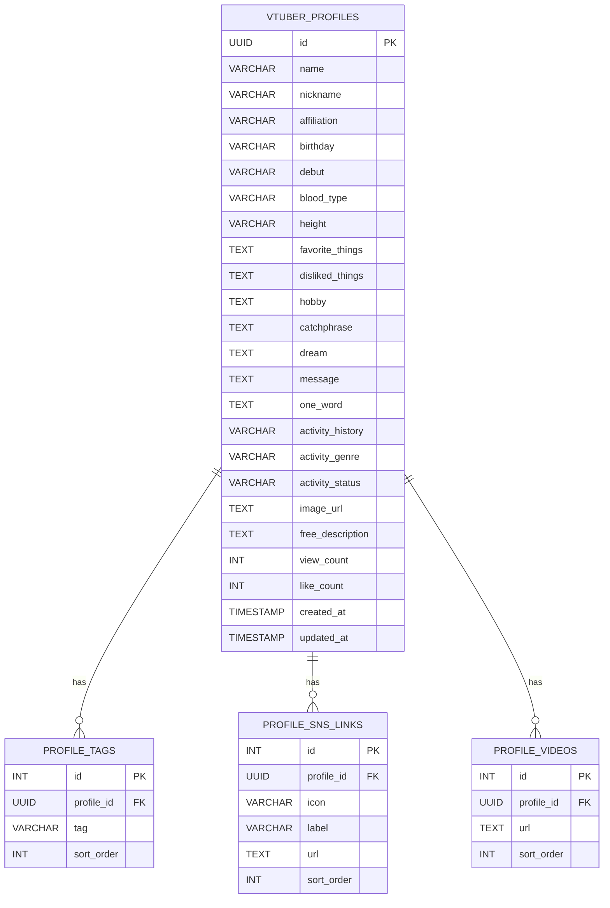

# 論理名・物理名付きER図

```mermaid
erDiagram
    %% 物理名: vtuber_profiles / 論理名: VTuberプロフィール
    VTUBER_PROFILES {
        UUID id PK
        VARCHAR name
        VARCHAR nickname
        VARCHAR affiliation
        VARCHAR birthday
        VARCHAR debut
        VARCHAR blood_type
        VARCHAR height
        TEXT favorite_things
        TEXT disliked_things
        TEXT hobby
        TEXT catchphrase
        TEXT dream
        TEXT message
        TEXT one_word
        VARCHAR activity_history
        VARCHAR activity_genre
        VARCHAR activity_status
        TEXT image_url
        TEXT free_description
        INT view_count
        INT like_count
        TIMESTAMP created_at
        TIMESTAMP updated_at
    }
    %% 物理名: profile_tags / 論理名: タグ
    PROFILE_TAGS {
        INT id PK
        UUID profile_id FK
        VARCHAR tag
        INT sort_order
    }
    %% 物理名: profile_sns_links / 論理名: SNSリンク
    PROFILE_SNS_LINKS {
        INT id PK
        UUID profile_id FK
        VARCHAR icon
        VARCHAR label
        TEXT url
        INT sort_order
    }
    %% 物理名: profile_videos / 論理名: 動画リンク
    PROFILE_VIDEOS {
        INT id PK
        UUID profile_id FK
        TEXT url
        INT sort_order
    }

    VTUBER_PROFILES ||--o{ PROFILE_TAGS : has
    VTUBER_PROFILES ||--o{ PROFILE_SNS_LINKS : has
    VTUBER_PROFILES ||--o{ PROFILE_VIDEOS : has
```
