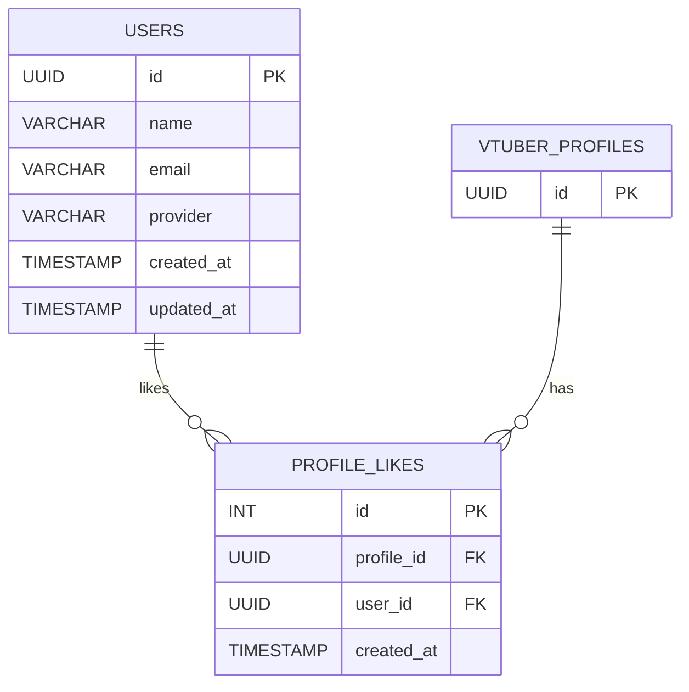

# 拡張用テーブル（論理名・物理名付き）

```mermaid
erDiagram
    %% 物理名: users / 論理名: ユーザー
    USERS {
        UUID id PK
        VARCHAR name
        VARCHAR email
        VARCHAR provider
        TIMESTAMP created_at
        TIMESTAMP updated_at
    }
    %% 物理名: profile_likes / 論理名: いいね履歴
    PROFILE_LIKES {
        INT id PK
        UUID profile_id FK
        UUID user_id FK
        TIMESTAMP created_at
    }
    %% 物理名: vtuber_profiles / 論理名: VTuberプロフィール
    VTUBER_PROFILES {
        UUID id PK
    }

    USERS ||--o{ PROFILE_LIKES : likes
    VTUBER_PROFILES ||--o{ PROFILE_LIKES : has
```
