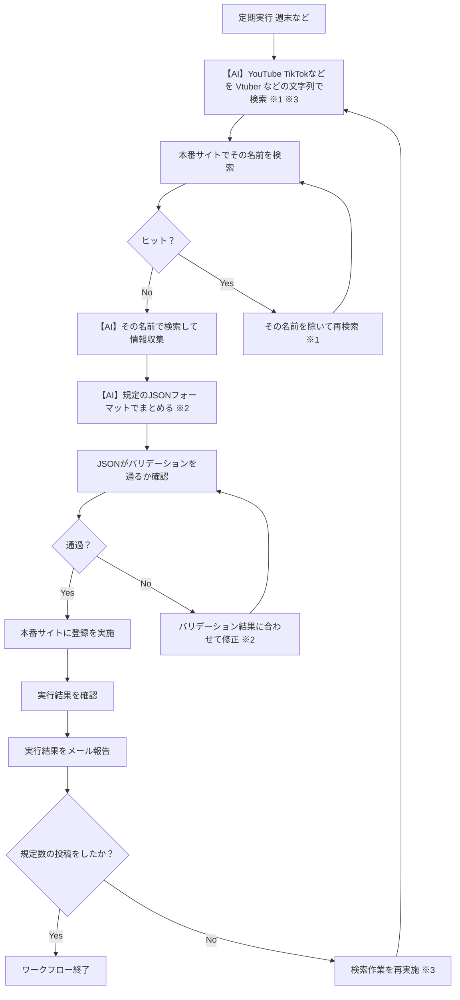

# AIループエンジニアリング設計

## リリース後コンテンツ拡充（CD）フローチャート

```mermaid
flowchart TD
    A[定期実行 週末など] --> B[【AI】YouTube TikTokなどを Vtuber などの文字列で検索 ※1 ※3]
    B --> C[本番サイトでその名前を検索]
    C --> D{ヒット？}

    D -->|No| F[【AI】その名前で検索して情報収集]
    F --> G[【AI】規定のJSONフォーマットでまとめる ※2]
    G --> H[JSONがバリデーションを通るか確認]
    H --> I{通過？}

    I -->|Yes| K[本番サイトに登録を実施]
    K --> L[実行結果を確認]
    L --> M[実行結果をメール報告]
    M --> N{規定数の投稿をしたか？}
    N -->|Yes| P[ワークフロー終了]

    D -->|Yes| E[その名前を除いて再検索 ※1]
    E --> C

    I -->|No| J[バリデーション結果に合わせて修正 ※2]
    J --> H

    N -->|No| O[検索作業を再実施 ※3]
    O --> B
```

## 注釈

- ※1: 同名ヒット回避のため、既出候補を除外しながら検索対象を継続的に更新する。
- ※2: 規定JSONスキーマに準拠するまで、生成とバリデーションを反復する。
- ※3: 投稿目標件数に達するまで、候補探索から登録までのループを継続する。
